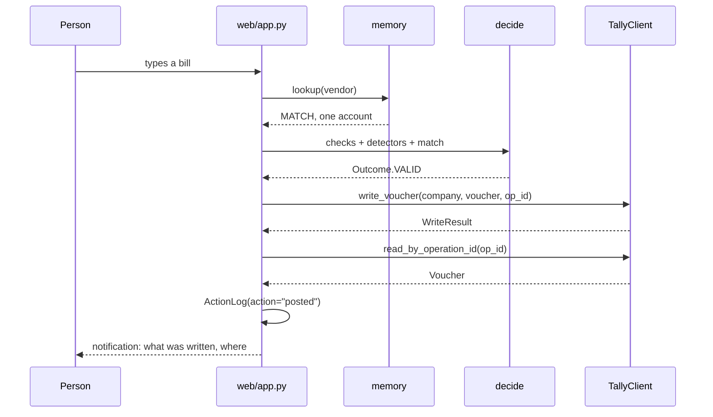
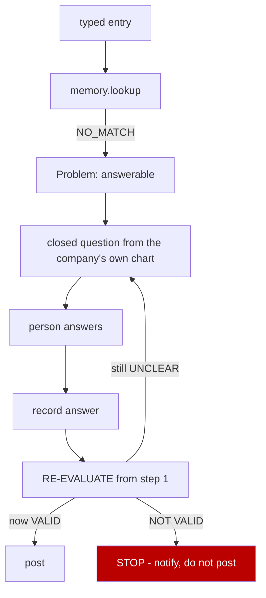
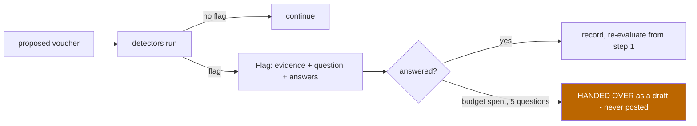
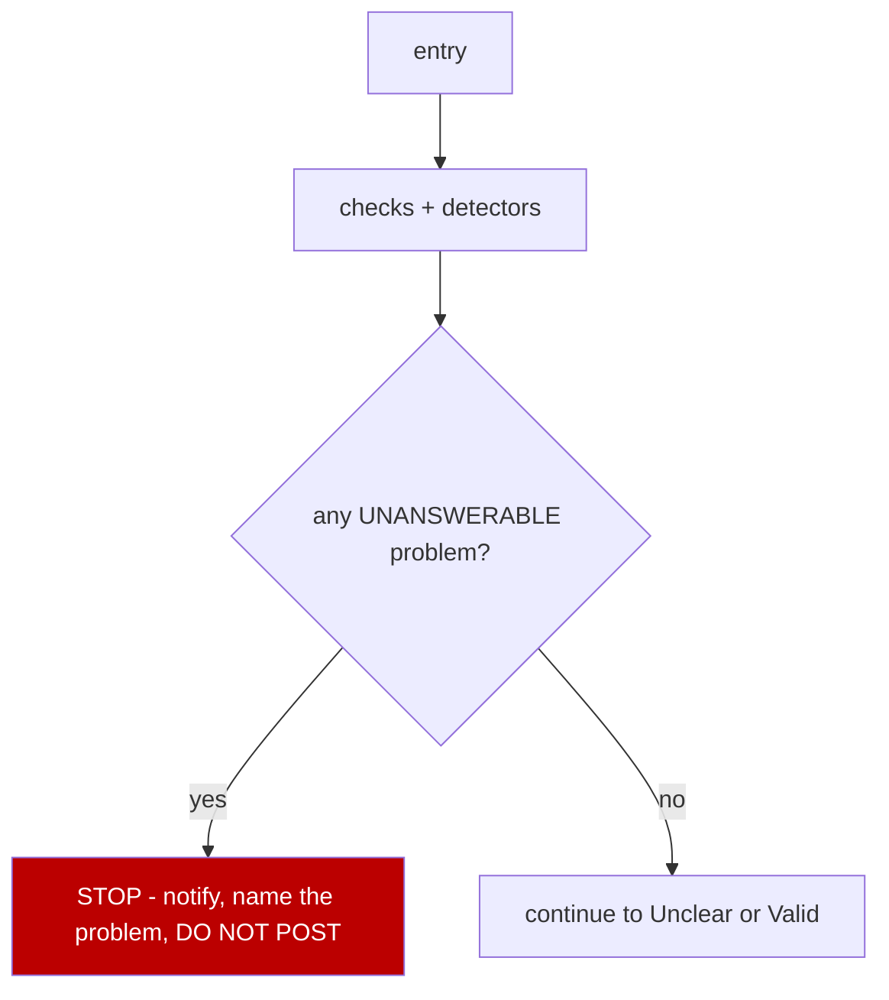
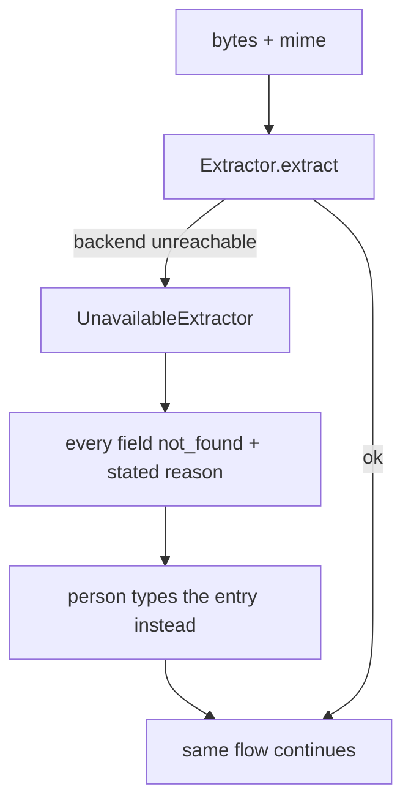
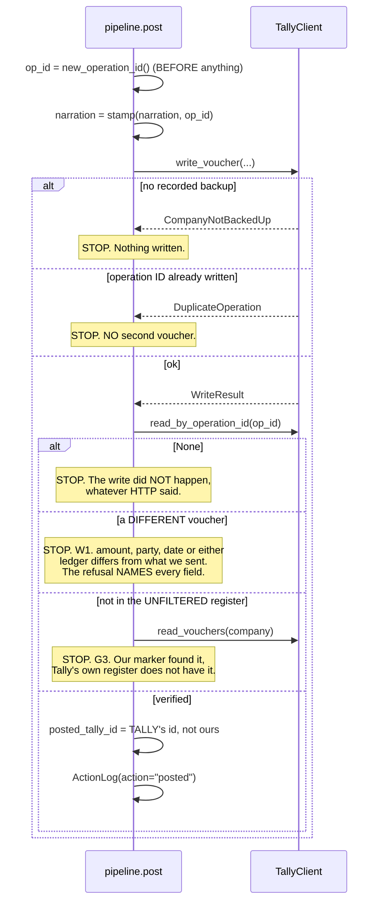
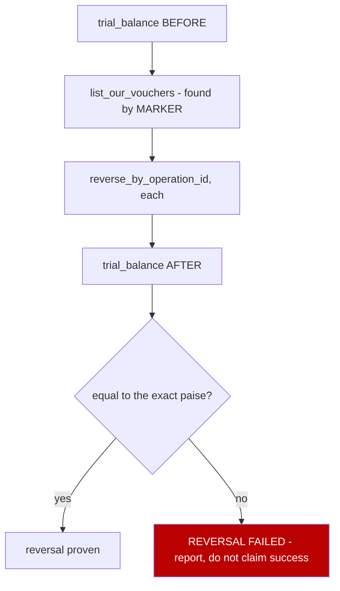
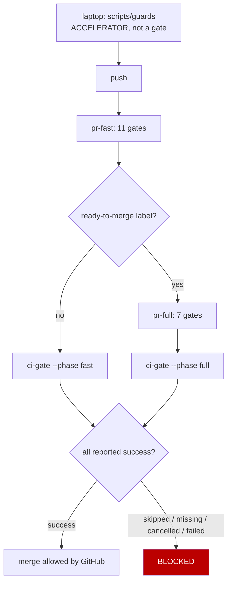
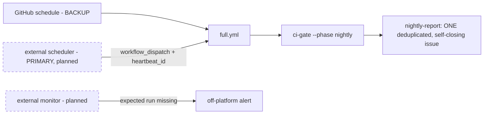

# ARCHITECTURE — Accountant Dad

**This is the build blueprint.** It tells an engineer how the system is
structured and how to finish it, without reading the project history.

**It is not the project record.** History, evidence, run IDs, progress, risks,
measurements and the decision log live in
[`PROJECT_STATE.md`](./PROJECT_STATE.md). What is currently costing more than it
should, and the smallest guard for each class of defect, lives in
[`BOTTLENECKS.md`](./BOTTLENECKS.md). If you need to know *what happened* or
*what is verified today*, read those. If you need to know *how the system works*,
read this.

**This file contains no status, no run IDs, no measurements and no history.**
Where a design rule exists *because* of a measurement, the rule is stated here
and the number is linked, never copied.

**Status lives in exactly one file: [`CONTROL_PLANE.yaml`](./CONTROL_PLANE.yaml).**
Nothing here says whether a phase has passed, whether a component works, or how
far the build has got. `scripts/validate_project_truth.py` reads this file and
fails the build if a status claim reappears in it.

Packages are marked **present** or **absent**. Read those two words narrowly:
they say whether a path exists in the repository today, and nothing else.
**`present` is not `working`, not `finished` and not `verified`** — a package can
be present, imported, tested and still be a stub. Whether it does its job is a
status question and the answer is in the control plane.

> **Audit note, 2026-08-10.** Three status claims were removed from this file
> today and are recorded in
> [`artifacts/document_contradictions.md`](../artifacts/document_contradictions.md):
> a hard-coded count of client-fixture tests in the Tally-spine exit, the same
> count in the four-outcome table under it, and the words "not started" on the
> planned-packages section. The design they described is unchanged.

---

## 1. Architecture summary

```
person
 └─► local web app                       accountant/web/app.py
      └─► typed input OR extraction adapter    accountant/extract/
           └─► ExtractedRecord                 every field valued or not_found
                └─► memory lookup over Tally history   accountant/memory/
                     └─► deterministic checks + detectors  accountant/checks.py
                          │                                accountant/detect/
                          └─► DECISION                     accountant/decide.py
                               ├─ Not valid → notify, DO NOT POST
                               ├─ Unclear   → ask, record, RE-EVALUATE
                               └─ Valid     → post
                                    └─► Tally write        accountant/tallyio/
                                         └─► read-back verification
                                              └─► action log + reversal
```

**The rule that governs every path:**

```
Not valid → notify, do not post.
Unclear   → ask permitted plain-language questions, then re-evaluate from the top.
Valid     → post automatically. No human confirmation is required or requested.
```

An answer to a question is **new information, not authorisation.** The entry
re-enters the decision order and can still come out Not valid.

---

## 2. System boundaries

| Inside — we build and own | Outside — we depend on, never own |
|---|---|
| local web application | Tally's statutory ledger |
| Tally connector | Tally's own reports and trial balance |
| memory index | the third-party document reader |
| deterministic detectors | GitHub Actions platform |
| Indian accounting rules lookup | external nightly scheduler |
| extraction **adapter** | owner GitHub credentials, secrets, administration |
| SQLite: our index, flags, action log | the customer's books |
| synthetic generator and scoring harness | |
| CI and verification tooling | |

**Two exclusions define the product:**

- **No second ledger.** Tally is the book of record. If the customer deletes this
  software, their books are complete and untouched. Building a parallel ledger
  would serve nobody and removed roughly two thirds of the original scope.
- **No document reader.** Reading a bill is commodity. Extraction sits behind an
  adapter so the commodity stays somebody else's problem.

**We never store the customer's books.** SQLite holds our index, our flags and
our action log. Nothing else.

---

## 3. Technology choices that affect the design

Only choices with architectural consequence. The full dev-dependency inventory
lives in `pyproject.toml`; version history and CI evidence live in
[`PROJECT_STATE.md`](./PROJECT_STATE.md).

| Choice | Architectural consequence |
|---|---|
| **Python** | the whole product; pinned to **3.14** via `.python-version` |
| **Runtime dependencies: `[]`** | the app installs and runs with a stdlib Python and nothing else. No supply chain at runtime. `pyproject.toml` declares `dependencies = []` and names **no web framework**. |
| **`accountant/web/app.py` — stdlib `http.server`** | **no framework is present.** No npm, no build step, no bundler. Introducing a framework is **not part of this architecture** unless separately approved. |
| **TallyPrime / Tally.ERP 9 over HTTP/XML, host and port configurable** | Tally is Windows-only and exposes no public or cloud API. This forces the app to run on a machine that can reach the Tally host. |
| **Windows VM on macOS (UTM)** | the development and first-slice environment. **`localhost` on the host and `localhost` in the VM are different machines** — the guest is reached over the VM's private bridge network, not over loopback. `TallyConfig` therefore takes a **host and a port** and does not assume `localhost:9000`. `TallyConfig.is_loopback` exists so a caller or a test can assert the tighter rule where it does apply. Plain HTTP with no authentication must stay on a private, trusted network. |
| **SQLite** | our data only, single file, no server to run alongside the app |
| **Integer paise, never float** | currency is exact. `amount_paise: int`. A reversal that must restore a trial balance *exactly* cannot tolerate binary floating point. |
| **`pytest-gremlins`** | mutation testing needs `COVERAGE_CORE=pytrace`; on the default `sysmon` core the test-to-line mapping is silently incomplete. Every coverage and mutation job sets it. |
| **`uv`** | lockfile-driven installs; `--frozen` is itself the lockfile gate |

**One tool per responsibility.** Black, Flake8, isort, Pylint, mypy, Poetry, tox,
mutmut, MutPy and Cosmic Ray are deliberately absent — each overlaps something
already present.

---

## 4. Component architecture

Format for every package: path · existence · current implementation · target
responsibility · dependencies · phase.

### 4.1 Shared schema — `accountant/schema.py` · **present**

Nine frozen types. Every other component speaks these and nothing else.

```python
Outcome       StrEnum          VALID | UNCLEAR | NOT_VALID
MatchStatus   StrEnum          MATCH | CONFLICTED | NO_MATCH
MatchResult   frozen           status, vendor_key, accounts
CheckResult   frozen           name, passed, detail
Flag          frozen           voucher_id, detector, severity, reason
LineItem      frozen           description, amount_paise
Voucher       frozen           id, date, party, narration, debit_account,
                               credit_account, amount_paise, gst_paise,
                               tally_id, provenance
Decision      frozen           outcome, reason, question_options
ActionLog     frozen           ts, action, voucher_id, detail
```

| | |
|---|---|
| **Forbidden** | any mutable type; any float for money; any Tally-shaped field |
| **Failure behaviour** | frozen dataclasses — mutation raises |
| **Tests** | exercised by every other test file |

`Voucher.provenance` is not optional decoration. It is what makes the
Hallucinate definition measurable: **a field with no source is a hallucination by
definition.**

### 4.2 Tally connector — `accountant/tallyio/` · **present**

| File | Existence | Implementation |
|---|---|---|
| `client.py` | **present** | `TallyClient` Protocol, 9 methods; `new_operation_id`, `marker_for`, `stamp`, `operation_id_in`; `DuplicateOperation`, `CompanyNotBackedUp`; `WriteResult` |
| `fake.py` | **present** | in-memory Tally implementing all 9 methods |
| `real.py` | **present** | `RealTally`, all 9 methods. XML over HTTP, host and port configurable via `TallyConfig`. Stdlib only. |

**The interface — the single most important contract in the system:**

```python
list_companies()                              -> tuple[str, ...]
read_accounts(company)                        -> tuple[str, ...]
read_vouchers(company)                        -> tuple[Voucher, ...]
trial_balance(company)                        -> dict[str, int]      # paise
write_voucher(company, voucher, operation_id) -> WriteResult
read_by_operation_id(company, operation_id)   -> Voucher | None
reverse_by_operation_id(company, operation_id)-> bool
list_our_vouchers(company)                    -> tuple[Voucher, ...]
backed_up(company)                            -> bool
```

**Why there is a ninth method** (added 2026-08-09, G5.2). The backup gate lived
only inside `write_voucher`, and that had two consequences. Nothing could ASK —
a bulk reversal must state the backup identity before it runs, and a fact only
discoverable by attempting a write is not a fact a preview can report. And
`reverse_by_operation_id` was **not gated at all**: a delete is the more
destructive of the two operations and it was the ungated one, so a batch could
empty a company nobody had backed up while a single write to that same company
was refused. Both are closed by this method plus the gate now on the delete
path. It is read-only and reads the same `BackupLog` both write paths gate on,
so what a preview reports and what a write enforces cannot drift apart.

| | |
|---|---|
| **Inputs** | company name, `Voucher`, operation ID |
| **Outputs** | `Voucher`, `WriteResult`, trial balance dict, booleans |
| **State** | none of ours — Tally holds it |
| **Depends on** | `schema.py` only |
| **Forbidden** | letting XML, HTTP or the Tally port leak outside this package. Writing an unmarked voucher. Reversing by amount or by narration text. |
| **Failure** | `CompanyNotBackedUp` before any write · `DuplicateOperation` on a repeated operation ID · `read_by_operation_id` returning `None` means the write did not happen, whatever HTTP said |
| **Tests** | `tests/test_tally_contract.py` — client-agnostic by construction, 15 tests behind a `client` fixture |

**Private network only.** The Tally port has no auth model beyond network
reachability. Where Tally and the app share a machine, the connector binds
loopback and a test asserts no external interface is used. Where Tally runs in a
VM, the host is on the VM's private bridge and the same rule applies to that
network: plain HTTP, no auth, never routable.

**Why this boundary exists (correction C3):** without it, XML handling leaks into
memory, detectors and the web app, and the connector cannot be stubbed. With it,
the entire system is testable against `FakeTally`, and `real.py` drops in with no
change anywhere else.

#### What Tally's wire format forces on this package

These are design constraints, not preferences. Each is contained inside
`accountant/tallyio/` so nothing else has to know about it. The evidence that
established each one is in
[`PROJECT_STATE.md` §21](./PROJECT_STATE.md#21-tally--first-real-evidence).

| Constraint | Consequence for the design |
|---|---|
| **Tally can emit XML that is not valid XML.** It writes numeric character references to characters XML 1.0 forbids. | `sanitise()` strips illegal numeric character references **before** the bare-ampersand pass. Order matters: escaping first would rewrite the illegal reference into a well-formed one and turn an unparseable document into a **parseable lie**. |
| **Every response carries a `<CMPINFO>` header whose children are counts**, one of which is literally named `VOUCHER`. | Voucher parsing is scoped to **`BODY/DATA`**. Nothing in this package may find a record by scanning the whole document for a tag name. |
| **A voucher is named for Alter/Cancel/Delete by a `TAGNAME`/`TAGVALUE` attribute pair** — a TDL method name and its value — **not by child tags.** | The delete envelope carries the pair as attributes. Child-tag identity is forbidden here; it is silently ignored by Tally, which is worse than an error. |
| **`REMOTEID` is a sync-lineage field, not a handle.** Tally stamps it on export, but a locally-imported voucher has no remote-index entry. | `MASTERID`, `REMOTEID`, `GUID` and `VCHKEY` are treated as **locators** — preserved exactly as received, never used as this application's identity. The narration marker `[ACCOUNTANT_DAD:<op_id>]` is the identity, and reads, duplicate detection and reversal match on it and on nothing else. |
| **The same field uses two date formats.** The `DATE` **attribute** is `dd-MMM-yyyy`; the `DATE` **child tag** is `yyyyMMdd`. | Both are produced by this package and by nothing else. A caller never formats a Tally date. |
| **`trial_balance()` returns derived heads alongside posted ledgers.** A derived closing figure is not a posting. | The trial balance is a **before/after equality check**, never a sum-to-zero assertion. Any future code that needs the sum must first exclude or tag derived heads — see [`BOTTLENECKS.md` A4](./BOTTLENECKS.md#a4--trial_balance-includes-a-derived-figure). |
| **A Tally licence tier can restrict which voucher dates are accepted.** | The connector surfaces the refusal; it never rewrites a date to make a write succeed. |

### 4.3 Memory index — `accountant/memory/index.py` · **present**

| | |
|---|---|
| **Responsibility** | vendor → account and phrase → account, learned from the company's own posted history |
| **Interface** | `normalise_vendor(name)` · `MemoryIndex.from_vouchers(...)` · `.record(vendor, account)` · `.lookup(vendor) -> MatchResult` · `.times_posted(vendor, account)` · `.accounts_ever_used()` · `.vendors()` |
| **Inputs** | `tuple[Voucher, ...]` read through the connector |
| **Outputs** | `MatchResult` — `MATCH` with one account, `CONFLICTED` with several, or `NO_MATCH` |
| **State** | SQLite, ours |
| **Depends on** | `schema.py`, and the connector for its input |
| **Forbidden** | **any model call. Any network call except through the connector. Any guess.** A vendor seen with two accounts returns `CONFLICTED`, never a pick. **Any index built from more than one company.** |
| **Failure** | unseen vendor → `NO_MATCH`, which becomes a question, never a fallback account |
| **Tests** | model-free and network-free asserted by test |

**It cannot hallucinate by construction**, and it handles the repeat bulk of
entries. Spelling variants collapse through `normalise_vendor`.

#### Two invariants, both load-bearing

**1. Memory is COMPANY-LOCAL ONLY. Every customer is a permanent cold start.**

Vendor→account mappings do **not** transfer between organisations. This was
measured against real published data, not assumed — the numbers are in
[`PROJECT_STATE.md` §22](./PROJECT_STATE.md#22-product-quality--first-measurements-on-real-data).
The architectural consequences:

```
no index is ever built from more than one company's history
no mapping learned at one customer is shipped to another
a pooled or shared model across customers is NOT part of this architecture
```

This removes work rather than adding it. It also means `memory/` is the only
component that can carry the repeat bulk of a real book, because nothing can be
pre-trained for a new customer.

**2. An EXISTING company must have its own Tally history bootstrapped before the
first proposal is shown.**

Because every customer is a cold start, an empty index for a company that has
years of posted history is a **PRODUCT FAILURE, not a neutral state.** The system
would ask about vendors the company has posted to hundreds of times, and the
person would correctly conclude it knows nothing.

```
bootstrap  = read_vouchers(company) -> MemoryIndex.from_vouchers(...)
             BEFORE the first proposal for an existing company

Forbidden  showing a proposal for an existing company from an empty index
Failure    an existing company with an empty index is reported as a
           bootstrap failure, never treated as a new company
```

The distinction between "new company, legitimately empty" and "existing company,
wrongly empty" is what the invariant turns on, and it is observable: an existing
company has vouchers the connector can read. Its tests are in the MVP completion
checklist, §11.

### 4.4 Detectors — `accountant/detect/detectors.py` · **present**

| Detector | Fires when |
|---|---|
| `vendor_switch` | vendor consistently posted to X, this one goes to Y |
| `first_use` | account never used before in this company |
| `magnitude` | amount far outside that account's own historical range |
| `gst_anomaly` | GST on an account that never carried GST |

`ALL_DETECTORS` holds four. `SLICE_4_DETECTORS` holds `vendor_switch` alone — the
architecture deliberately ships one detector into the real review screen before
wiring the rest.

**The limit of this design, stated plainly.** All four detectors answer one
question: *is this entry a **change** from this company's own history?* They
therefore **cannot see a standing practice**. An account that has always been the
wrong one never changes, so nothing fires. This is a property of the design, not
a bug in any detector.

```
detects      a change from history
cannot detect  a consistent, long-standing wrong treatment
```

**These four detectors do not broadly cover real accounting errors.** How many of
the error types auditors actually publish they do cover is a **measured number**
and lives in [`PROJECT_STATE.md` §22](./PROJECT_STATE.md#22-product-quality--first-measurements-on-real-data);
the gap and its proof work are tracked in
[`BOTTLENECKS.md` A1](./BOTTLENECKS.md#a1--detectors-cover-2-of-12-published-real-error-types).
Any claim of coverage in this architecture is limited to the sentence above.

**Adding a detector is not the default response to an uncovered error type.**
`accountant/taxonomy/` produces one `Proposal` per uncovered type; a proposal is
a hypothesis. A detector enters `ALL_DETECTORS` only when the error type it
targets has been shown to occur, and when the detector's own false-alarm cost has
been measured — see §4.11.

**Every `Flag` must carry:** detector name · voucher id · severity · concrete
evidence · the plain-language question · the allowed answers.

```
reason   (for the log)   20000000 paise to Purchases; highest ever is 380000 paise
question (for the human) That's ₹2,00,000. You usually pay Sharma Traders about
                         ₹3,800. Is that right?
answers                  [ Yes, that's right ]  [ No, let me fix it ]
```

| | |
|---|---|
| **Ranking** | by severity, deterministic, ties broken by voucher id |
| **Cap** | per-batch; overflow reported as a **count**, never silently dropped |
| **Forbidden** | any model call · a flag with no evidence · a flag with no question · any account name inside a question |
| **Failure** | a detector firing means *"this is surprising"*, never *"this is wrong"* — it produces a question, not a refusal |
| **Tests** | each detector fires on its own injected error; dismissals logged with detector name and voucher id |

### 4.5 Deterministic checks and the decision — `checks.py`, `problems.py`, `questions.py`, `decide.py` · **present**

```
checks.py     boolean functions over a record → CheckResult
problems.py   a failed check or a fired flag → Problem (answerable or not)
questions.py  Problem → a closed, plain-language question
decide.py     decide_problems(problems, asked) -> Decision
              decide(...)                      -> Decision
```

**Decision order, first match wins:**

```
1. NOT VALID   at least one problem that NO answer could fix   → notify, do not post
2. UNCLEAR     at least one ANSWERABLE problem                 → ask, record, re-evaluate from 1
3. VALID       every check passes, exactly one consistent
               account, no detector fired                      → post
```

Not-valid beats unclear: if a problem cannot be answered, asking about a
different one is pointless.

| | |
|---|---|
| **Question budget** | stop when a further question would not change the outcome, **or at 5 questions**, whichever comes first |
| **Non-overlapping** | each question maps to a distinct problem id; a repeat fails the test |
| **Forbidden** | a question containing any account name from the company's chart |
| **Failure** | budget spent → the entry is **handed over** as a draft, never posted, marked for a person. Not a refusal — the honest end of a conversation that stopped making progress. |

### 4.6 Pipeline — `accountant/pipeline.py` · **present**

The flow, as one object moving through states.

```python
Draft
build_draft(...)              -> Draft
evaluate(draft)               -> Draft      runs checks, detectors, decision
next_question(draft)                        the next question, or None
answer(draft, account, pid)   -> Draft      records, then RE-EVALUATES
post(draft, client)           -> Draft      Valid only; write, read back, log
reverse(draft, client)        -> bool
run(...)                      -> Draft      the whole path
```

`Draft.outcome` and `Draft.reason` **raise on an unevaluated draft** rather than
returning a default. An unevaluated draft has no outcome, and saying otherwise
would be a lie in the type.

**Where each ledger leg comes from, and why they come from different places.**

| leg | proposed by | from |
|---|---|---|
| debit — what the money was FOR | `build_draft` | this company's vendor→account index |
| credit — where the money came FROM | `evaluate` | this company's own posted credit legs for this vendor, **unanimous or nothing** |

Neither is ever chosen from a list of likely names, and a value that came from
nowhere is impossible to write: both legs carry a `provenance` entry, one of
`company_history`, `human_answer` or `not_found`.

The credit leg is proposed in `evaluate` rather than in `build_draft`, and that
asymmetry is the safety property. `evaluate` is the only function that gives a
draft a `decision`, and `post` refuses a draft that has none. Siting the
proposal there makes it structurally impossible to post a voucher whose funding
leg was not either read from the company's books or answered by a person — a
caller cannot skip `build_draft` and reach `post` with a blank leg. It fills an
EMPTY leg only, so a human answer is never overwritten by the pattern.

`answer(draft, account, pid)` routes by problem id: the funding answer lands on
the credit leg, everything else on the debit leg. `Problem.id` and
`Question.problem_id` are the same string by construction — when they disagree
the answer is filed under a name nothing looks for and the question is asked
forever.

### 4.7 Extraction adapter — `accountant/extract/adapter.py` · **present**

```python
class Extractor(Protocol):
    def extract(self, data: bytes, mime: str) -> ExtractedRecord: ...

ExtractedRecord   date, party, total_paise, tax_paise, line_items,
                  raw_text, backend, per_field_source
```

Three implementations present: `TypedTextExtractor`, `StubExtractor`,
`UnavailableExtractor`.

| | |
|---|---|
| **Accepts** | PDF, PNG, JPG, DOCX, plain text |
| **Forbidden** | **any OCR, image processing or layout analysis.** A test asserts this package contains none. The rule is enforced, not trusted. |
| **Completeness** | every named field carries a value **or an explicit `not_found`**. A silently blank field fails the test. |
| **Provenance** | `per_field_source` flows into `Voucher.provenance` |
| **Failure** | backend unreachable → `UnavailableExtractor` returns every field `not_found` with a stated reason; the person types the entry instead |
| **Swappability** | changing the backend changes **no code outside this package** — asserted with `StubExtractor` |

### 4.8 Web application — `accountant/web/app.py` · **present**

**Stdlib `http.server`. Server-rendered HTML. No framework, no JavaScript build,
no runtime dependency.** It runs with one command on the user's machine, because
the connector needs localhost access to Tally.

| Responsibility | Detail |
|---|---|
| accept | typed text and file upload |
| show | the proposed voucher with **every field's provenance visible** |
| show | flags with their stated reason |
| ask | plain-language questions, **one at a time**, closed answers, **never a ledger account name**; the chosen account is shown afterwards so nothing is hidden |
| re-evaluate | after every answer, from step 1 |
| post | **only when the outcome is Valid** — a test asserts no other path posts |
| record | outcome and reason for every entry, in the action log |
| notify | what was written and where, for Valid; what failed and that nothing was posted, for Not valid |
| list | every voucher we wrote, with bulk reverse |

**Forbidden:** multi-user, login, accounts, cloud hosting, mobile, styling beyond
legibility.

### 4.9 Synthetic generator and error injector — `accountant/generate/` · **present**

Phase 9, child #1. Produces a book with known answers, so a detector's catch
rate can be measured against something rather than asserted.

| File | Existence | Implementation |
|---|---|---|
| `book.py` | **present** | `generate_book(seed=, months=)` → `Book`. A fictional Nagpur building-materials trader: 15 vendors, 12 posted accounts, 3 accounts in the chart deliberately never posted to, monthly / quarterly / annual items, seasonal irregular purchases, per-vendor spelling noise. |
| `inject.py` | **present** | `count_for`, `inject(vouchers, rate=, seed=)` → `InjectedBook`. Corrupts an exact fraction into `vendor_switch`, `first_use`, `magnitude`, `gst_anomaly` — the four `ALL_DETECTORS` names and no others. |
| `serialise.py` | **present** | JSON Lines, keys sorted, ASCII, no spaces. `write_book` puts the voucher stream and the answer key in **two separate files**. |

| | |
|---|---|
| **Inputs** | a seed, a month count, an error rate as a `Fraction` |
| **Outputs** | `tuple[Voucher, ...]` — the same frozen type the connector returns — plus `tuple[Corruption, ...]` ground truth, kept apart |
| **State** | none. `generate_book` and `inject` are pure functions of their arguments |
| **Depends on** | `schema.py`, and `memory.index.normalise_vendor` so name noise collapses the way the index will collapse it |
| **Forbidden** | any float, anywhere, including seasonality and GST · the module-level `random` global · iterating a set or frozenset on the output path · any corruption marker inside a voucher field · rounding a requested error rate |
| **Failure** | a rate that is not a whole number of vouchers is **refused**, naming the numbers · a quota with too few eligible vouchers is **refused**, never quietly under-delivered · fewer than 12 months is refused |
| **Tests** | `tests/test_generate.py` — one test per frozen acceptance criterion, plus the criterion tested from the other side: `balances` is checked against vouchers that do not balance, and a different seed is checked to produce different bytes |

**Seasonality and GST are integer basis points with `//`.** A book that cannot be
reproduced to the paise cannot prove a detector caught anything.

**The two-file split is the product, not the packaging.** Every voucher record
carries identical keys whether it was corrupted or not, ids are unchanged by
injection, and a test asserts that the set of records differing from the clean
book equals exactly the set of ids in the answer key — no more, so nothing is
marked; no fewer, so the answer key is complete.

### 4.10 Scoring harness — `accountant/score/` · **present**

Phase 9, child #4. Runs the evaluation pipeline over a generated book plus its
ground truth and reports the three owner-set targets, each as an explicit
`PASS` or `FAIL`.

| File | Existence | Implementation |
|---|---|---|
| `book.py` | **present** | `Book`, `GroundTruth`, `InjectedError` — the evaluation input, ground truth kept separate from the voucher stream |
| `harness.py` | **present** | `score(...)` → `ScoreReport`; `N1_MAX_FALSE_ALARMS_PER_100`, `N2_MAX_REVIEW_PERCENT`, `N3_MIN_CATCH_PERCENT`; `EntryResult`, `ErrorTypeCatch`, `MetricResult`, `Status` |
| `report.py` | **present** | `render` — the report, including the pair of timings that produced it |

| | |
|---|---|
| **Inputs** | a `Book`, its `GroundTruth`, and **R** and **D** — seconds to read one entry and seconds to dismiss one flagged entry |
| **Outputs** | `ScoreReport` — N1, N2, N3, each `PASS` or `FAIL` |
| **State** | none |
| **Depends on** | `schema.py`, `detect/`, `generate/` |
| **Forbidden** | **any write to Tally** — this package evaluates and counts · a **default** for R or D; both are self-timed inputs, and inventing them would turn a stopwatch reading into a fake measurement · inventing an N4, which the frozen plan does not define · **tuning a threshold so a metric passes** |
| **Failure** | a target that is not met is reported `FAIL`, never softened, never annotated away |
| **Tests** | `tests/test_score.py` |

**The N3 caveat is printed in every report this package produces:** constructed
errors matched to purpose-built detectors should score near 100%. N3 is a
**build-correctness check**, not evidence of product value.

**Current values are status, not design** —
[`PROJECT_STATE.md` §22](./PROJECT_STATE.md#22-product-quality--first-measurements-on-real-data).

### 4.11 Real error taxonomy — `accountant/taxonomy/` · **present**

Phase 9, child #7. Answers the question the four detectors were written without:
*what do auditors actually find?* It needs no real error data to do it, because
auditors publish the taxonomy.

| File | Existence | Implementation |
|---|---|---|
| `sources.py` | **present** | `Source` — each published document with a **URL and a retrieval date**. **An entry without both does not load.** |
| `findings.py` | **present** | one `Finding` per audit paragraph, each assigned to one `ErrorType`. Amounts are **integer paise**; `paise_from_crore` does the conversion. |
| `coverage.py` | **present** | every `ErrorType` mapped to a detector name **read from `ALL_DETECTORS`**, or to `UNCOVERED`; one `Proposal` per uncovered type; `detectors_targeting_no_error_type()` for the reverse direction |
| `report.py` | **present** | the table, and `uncovered_count()` as a **single number** |

| | |
|---|---|
| **Outputs** | the coverage table · `uncovered_count()` · the set of detectors that target no published error type |
| **Depends on** | `detect.detectors.ALL_DETECTORS` — the detector names are **read, never restated**, so the table cannot drift from the code |
| **Forbidden** | **any estimate of how often an error type occurs.** The published record does not support such a number, and an invented one would quietly become the argument for keeping or dropping a detector. · a source with no URL or no retrieval date · a hand-written detector name |
| **Failure** | an unmapped `ErrorType` is `UNCOVERED` and counted, never omitted |
| **Tests** | `tests/test_taxonomy.py` |

**This package is a mirror, not a roadmap.** It reports the gap. It does not
decide that the gap must be closed, and a `Proposal` never becomes a requirement
on its own.

### 4.12 Public-data ingest — `accountant/ingest/` · **present**

Phase 9, child #5 and child #8. UK central-government spend data, used for one
purpose: to answer, for free, whether account mappings transfer between
organisations.

| File | Existence | Implementation |
|---|---|---|
| `sources.py` | **present** | the published departmental sources |
| `fetch.py` | **present** | `check_url` / `read_url` / `fetch_source` behind a one-method `Opener` Protocol. **https only, gov.uk hosts only, size-capped, refused before the URL is opened.** |
| `spend.py` | **present** | the loader. Header alias tables, integer-paise amount parsing, `Narrative` → narration and `Expense Type` → debit account |
| `crossorg.py` | **present** | `split` each department's own rows in published order, then measure **every ordered pair**. Refuses a cross-organisation claim built on fewer than `MIN_PAIRS` departments. |
| `report.py` | **present** | the per-pair table, with the gap as a single number per pair |
| `fixtures/` | **present** | **real published department files**, committed |

| | |
|---|---|
| **Forbidden** | **any float for money** — the decimal digits are parsed as integers · a URL that is not https on a gov.uk host · a cross-organisation claim from fewer than the minimum number of pairs · **an invented fixture** — a fixture that this project wrote cannot contain somebody else's typo, and the typos are the point |
| **Failure** | a present-but-**empty** column is **reported**, never silently treated as absent · an unrecognised header is named, never guessed |
| **Tests** | `tests/test_ingest.py`, against the committed real fixtures |

**Published government data is not schema-stable**, and the loader is built for
that rather than around it: the narration column appears under six different
names across departments, one of them carrying a misspelling and a trailing space
that are in the publisher's own file, and one department publishes its amount
column under a header that is a currency symbol. The specific shapes are recorded
in [`PROJECT_STATE.md` §22](./PROJECT_STATE.md#22-product-quality--first-measurements-on-real-data).

**What this package proved is in §4.3 as an invariant**: mappings do not
transfer, so memory is company-local and every customer is a permanent cold
start.

### 4.13 Planned packages — **absent from the repository**

**Verified absent from the repository.**

| Path | Existence | Target responsibility | Phase |
|---|---|---|---|
| `accountant/rules/` | **absent** | GST by HSN/SAC, TDS section/rate/threshold, Schedule III heads, debit/credit conventions, plain-English phrasebook. Every rule carries a source URL and retrieval date; **a rule with no citation fails to load.** | 8 |

---

### 4.14 Bulk reversal — `accountant/reversal.py` · **present**

The batch cleanup lifecycle, and the only thing in the system that touches many
vouchers at once. Added 2026-08-09 (G5.2); before it, `POST /reverse` took one
operation id out of a form and there was no batch path at all.

| | |
|---|---|
| **Inputs** | a `TallyClient`, a company, an explicit confirmation |
| **Outputs** | `Batch` — frozen, so a partial result cannot be edited into looking finished |
| **State** | one durable `ActionLog` row per voucher transition, written BEFORE the next attempt |
| **Depends on** | `pipeline.reverse_operation`, `schema`, `tallyio.client` |
| **Forbidden** | calling `client.reverse_by_operation_id`. Every undo goes through the doorway that compares the trial balance; an AST test asserts it. |
| **Tests** | `tests/test_bulk_reversal.py`, `tests/test_bulk_reversal_web.py`, `tests/test_reverse_all_cli.py` |

**Eight per-voucher states and seven batch states.**

```
PER VOUCHER                       BATCH
NOT_ATTEMPTED                     PREVIEW
PRECHECK_REFUSED                  CONFIRMED
EXPLICIT_REJECTION                REVERSING
REQUEST_SENT                      PARTIAL_FAILURE
REVERSED_VERIFIED                 UNKNOWN_OUTCOME
UNKNOWN_OUTCOME                   CRITICAL_FAILURE
WRONG_MOVEMENT                    COMPLETED
READBACK_FAILED
```

**The four failure categories are not interchangeable, and that is the design.**

| Category | Meaning | Batch becomes |
|---|---|---|
| `PRECHECK_REFUSED` | the request never went to Tally | `PARTIAL_FAILURE` |
| `EXPLICIT_REJECTION` | Tally said clearly it did not occur | `PARTIAL_FAILURE` |
| `UNKNOWN_OUTCOME` | it may have reached Tally and we cannot prove it | `UNKNOWN_OUTCOME` |
| `WRONG_MOVEMENT` | Tally answered yes and the ledgers say otherwise | `CRITICAL_FAILURE` |

`UNKNOWN_OUTCOME` is never treated as a rejection, and transport success is
never treated as accounting success. Those are the same mistake wearing
different clothes: believing an answer instead of reading the books.

**CLEANUP, NOT ROLLBACK.** Posting is setup; reversing is cleanup. When voucher
4 fails, vouchers 1–3 are **not** re-reversed — they are already correctly
cleaned up and putting them back would write entries nobody asked for. The
resting state is partial by design, and a resume finishes only what is
outstanding.

**`accounted` is not "did the books come back to where they started".** The
batch's baseline is taken immediately BEFORE the reversal and already contains
the vouchers about to be removed, so a successful batch is supposed to end
somewhere else. What it measures is narrower and stronger: `final == baseline +
the movements this batch verified`. It returns `None` — UNKNOWN — when any
outcome was settled by reconciliation rather than measured, because a read
proves a voucher is gone and cannot prove by how much the books moved.

**A resume needs two different things.** Reconciled (has every unknown been
turned into a fact by a read?) and approved (has a person seen those facts and
said go on?). A `CRITICAL_FAILURE` cannot be resumed at all.

---

## 5. Data flows

Every diagram shows where failure **stops** the flow.

### 5.1 Typed happy path



### 5.2 Unknown vendor — no match



**No automatic fallback account exists.** Not Suspense, not Sundry Expenses, not
anything. No match means ask.

### 5.3 Detector → question → re-evaluation



### 5.4 Not valid



### 5.5 Extraction backend failure



**The system continues.** A backend outage degrades to typed entry; it never
guesses and never silently blanks a field.

### 5.6 Write, read-back, and the duplicate retry



**Why identity and not presence.** Until 2026-08-09 this branch was `is None` and
nothing else: the voucher Tally handed back was read and then discarded. It
checked the label on the box and never opened it, so a voucher carrying our
marker with a different amount, party or date was accepted as proof — and so was
one present in the marker view but absent from the register and the trial
balance. **G3 is a claim about the posting path, so it has to be enforced there**,
not only in a standalone script. The check can refuse more; it can never post
more.

### 5.7 Bulk reversal



**Reversal targets the operation ID. Never an amount, never narration text.** Two
vouchers with the same amount and narration are normal in real books.

**The comparison is equality of the same trial balance before and after — not a
sum.** Tally returns derived closing figures alongside posted ledgers, and a
derived figure is not a posting, so the dict does not sum to zero and was never
required to. Equality is the stronger check anyway: it catches a change in any
head, including one this software did not touch.

### 5.8 CI — fast path, full path, aggregate



**`ci-gate` runs with `if: always()` and inspects `needs.*.result` itself**,
because a job GitHub skips reports **Success** to required checks. A conditional
job can therefore never be the only required protection.

### 5.9 Nightly



Dashed = planned, not built. A watchdog hosted on the same scheduler cannot
detect that scheduler failing.

---

## 6. MVP definition

**The smallest thing that touches reality:**

```
one typed entry
 → one Tally company read
 → memory bootstrapped from THAT company's own history   (§4.3, invariant 2)
 → exact vendor lookup
 → Valid / Unclear / Not valid decision
 → one plain-language question on no-match
 → Valid-only marked write
 → read-back
 → action-log record
 → reversal
```

**The bootstrap step is not optional and is not an optimisation.** For an
existing company it is the difference between a system that knows the company's
own vendors and one that asks about every single one. See §4.3.

**The first product milestone, stated as one sentence:**

> One typed bill enters, one marked voucher appears in Tally, the voucher is read
> back, and reversal restores the exact prior trial balance.

**Deliberately NOT required for the first demonstration:** full document
extraction · all five file types · the rules corpus · three of the four detectors
· a full UI · the public-data proof track · cross-organisation generalisation ·
Claude auto-fix · the external nightly scheduler.

---

## 7. The complete build — phases 0 to 10

Each phase: **entry** (what must already hold) · **build** · **exit** (the
observable that ends it). A phase is not done until its exit observable is seen.

**Which phase the project is in, and which exits have been seen, is status. It
lives in [`PROJECT_STATE.md` §7](./PROJECT_STATE.md#7-architecture--see-architecturemd)
and §8, and appears nowhere in this file.** The phases below define the work and
the order; they never claim progress.

### Phase 0 — repository and safety

- **Entry:** nothing.
- **Build:** identity preflight; record the old repo's `pushed_at` and head SHA;
  `git init`; `.gitignore`; first commit; create the new public repo.
- **Exit:** the new repo exists **and** the old repo's `pushed_at` and head SHA
  are byte-identical to the recorded baseline.

### Phase 1 — CI foundation

- **Entry:** Phase 0.
- **Build, in this order — the order is the point:**

```
ci/gates.toml + gate_names.lock    the contract exists BEFORE any workflow
tests/test_gate_contract.py        duplicates, orphans, missing owners
scripts/guards + prek hook         Layer 1 works BEFORE any CI exists
scripts/install-actionlint         pinned, SHA-256 verified
.github/workflows/                 each file lints locally BEFORE it is pushed
branch protection                  only AFTER a run publishes the exact names
```

- **Interfaces:** `ci/check_aggregate.py --needs <json> --phase fast|full|nightly`
  · `ci/check_mutation.py` · `ci/check_stubs.py` · `ci/check_ruleset.py` (read-only).
- **Exit:** the gates block; deliberate failures fail; a red PR is refused; a
  direct push to `main` is refused.

### Phase 2 — the Tally spine

- **Entry:** TallyPrime running and its HTTP server reachable from the machine
  the app runs on. **Owner-supplied: the Tally installation and its licence
  tier.** A licence tier that restricts voucher dates restricts which of this
  phase's exit tests can run at all.
- **Build:** `accountant/tallyio/real.py`, implementing the same 9-method Protocol.

```
transport   HTTP POST to the configured host and port, timeout, bounded retry
request     <ENVELOPE><HEADER><TALLYREQUEST>Export</TALLYREQUEST>
              <TYPE>Collection</TYPE><ID>…</ID></HEADER>
              <BODY><DESC><TDL><TDLMESSAGE><COLLECTION …>
response    parsed into the SAME frozen types FakeTally returns
```

- **Order inside the phase — smallest first:**

```
1  ping                    → any response at all
2  list_companies          → ONE real company name   ← proves the whole transport
3  read_accounts           → the chart of accounts
4  read_vouchers           → posted history
5  trial_balance           → dict[str, int] in paise
6  write_voucher           → ONE marked voucher
7  read_by_operation_id    → the same voucher back
8  write again, same op_id → DuplicateOperation, NO second voucher
9  reverse_by_operation_id → trial balance back to the exact paise
```

- **Exit:** point the `client` fixture in `tests/test_tally_contract.py` at the
  real client; **every client-fixture test in that file passes**, with the
  fixture unmodified. Nothing outside `accountant/tallyio/` changes.
  The count is deliberately not written here — it is a property of the file and
  it has already drifted once. Read it from the file, or from
  [`CONTROL_PLANE.yaml`](./CONTROL_PLANE.yaml), metric
  `REALTALLY_CONTRACT_TESTS_PASSING`.

**The exit has four outcomes, not two.** A licence tier that restricts voucher
dates can refuse the fixture's date while the connector itself is correct, so
"the tests did not pass" and "the connector is wrong" must be different answers:

```
CONTRACT_PASS        every one passes against the real client, fixture unchanged
CONTRACT_FAIL        a test failed. The connector is wrong.
ENVIRONMENT_LIMITED  the environment refused the fixture, not the connector
NOT_RUN              no real client was reachable
```

`ENVIRONMENT_LIMITED` must never be reported as `CONTRACT_PASS`, and a control
date that the environment *does* accept never stands in for the fixture's own
date — a substitute that passes proves the mechanism, not the contract.

**The fixture date is part of the acceptance criteria, not an implementation
detail.** Editing it to suit an environment changes what the phase means, so it
is an owner decision and never a repair. Current licence mode, the measured
date behaviour and the standing owner decision are status, and live in
[`PROJECT_STATE.md` §24](./PROJECT_STATE.md).

### Phase 3 — the typed vertical slice

- **Entry:** Phase 2 exit.
- **Build:** **memory bootstrapped from the company's own posted history before
  the first proposal** (§4.3, invariant 2); one typed-entry form; one draft
  screen; exact vendor lookup; one validity decision; Valid-only write; one
  action-log row carrying outcome **and** reason; read-back verification.
- **Exit:** a typed bill posts itself, the marked voucher is found in **Tally's
  own report**, a test asserts **no path posts** an entry whose outcome is Not
  valid or Unclear, and a test asserts that **an existing company with an empty
  index is reported as a bootstrap failure rather than proposing anything.**

### Phase 4 — the no-match safety path

- **Entry:** Phase 3 exit.
- **Build:** `NO_MATCH` → `Problem` → a closed question whose options come only
  from that company's chart; record the answer; re-evaluate from step 1.
- **Exit, four assertions:**

```
unknown vendor       → a question is asked, never a guess
answer recorded      → the entry RE-ENTERS the decision order
no question string   contains any account name from the chart
NO fallback account  exists anywhere in the codebase
```

### Phase 5 — idempotency and reversal hardening

- **Entry:** Phase 4 exit.
- **Build:** harden the dangerous part **before** adding any intelligence.
  `operation_id` generated before posting and carried by all five of: the draft,
  the decision, the Tally narration, the action log, the reversal request.
  Duplicate rejection. Read-back. Bulk reverse over `list_our_vouchers`. Backup
  refusal.
- **Exit:** post N vouchers, bulk reverse, **the trial balance returns to its
  exact prior value in paise**; a retry with the same operation ID creates
  nothing; a company with no recorded backup is refused.
- **N = 10.** OWNER DECISION 2026-08-09. Fixed for this gate, not configurable,
  and never lowered to make a failing run pass. The fifteen pass conditions are
  in `ci/acceptance.py` and each is asserted individually, so a failing run
  names the condition rather than reporting "did not pass".
- **The batch is fail-closed and resumable.** DESIGN DECISION 2026-08-09: bulk
  reversal stops at the first unresolved voucher and resumes explicitly. Eight
  per-voucher states and seven batch states — see §4.14. Reversing ten vouchers
  is CLEANUP, not a rollback: a batch that stops at voucher 4 leaves 1–3
  reversed and does not put them back, and a resume finishes only the
  outstanding work.
- **Blocking at the first live step.** Every part of this phase that reads or
  writes a REAL Tally is gated on the acceptance test in §14 —
  `REQUIRED, NOT YET RUN`. Until it passes, those exits report
  `BLOCKED_ENVIRONMENT` and never `PASSED`.

### Phase 5B — operational readiness and repeatability

**A RELEASE GATE, NOT A FEATURE.** Inserted 2026-08-09 between Phase 5 and
Phase 6. Nothing is renumbered: Phases 6 to 10 keep the numbers they have
always had.

> The Phase 5B operational-readiness gate was previously described incorrectly
> as Phase 6 in an external planning message. Phase numbering is resolved here
> by retaining the repository's existing Phase 6 definition.

A feature milestone and a release gate are different things and are never merged
into one pass/fail claim. **Phase 5B passing does not make Phase 6 complete.
Phase 6 detector tests passing does not make Phase 5B pass.**

- **Entry:** Phase 5 exit.
- **Question:** was Phase 5 a lucky one-off, or is this repeatable enough for a
  tightly controlled pilot? One clean run answers neither, and three IDENTICAL
  clean runs prove the happy path three times. So the three runs differ:

```
A  the normal lifecycle
B  duplicate retry, a lost answer, a restart, reconciliation, explicit resume
C  refused at voucher 4, persisted partial, reconciled, explicitly resumed
```

- **Build:** `ci/readiness.py`. Plus company isolation, and a clean room — build
  a wheel, install it into an empty virtualenv with `--no-index --no-deps`,
  import it from a directory that is not the repo, and run the reversal command
  there **expecting it to refuse**. A command that "worked" in a clean room with
  no Tally would be a command that does not check.
- **Failures are injected into `FakeTally` and the simulator only.** A failure is
  never manufactured in real statutory books to test a failure path.
- **Exit, twelve conditions:** 3 of 3 runs pass · 30 of 30 voucher lifecycles ·
  zero wrong writes · zero duplicate writes · zero cross-company writes · zero
  unresolved unknown outcomes · zero trial-balance mismatches · zero cleanup
  mismatches · clean-room install succeeds · restart/recovery succeeds · every
  evidence bundle complete · an operator can read the result without raw logs.

**`NOT_RUN` is not a pass.** The gate fails while the clean room has not run, so
a run that quietly skipped its slowest check cannot be mistaken for a complete
one.

---

### Phase 6 — the first detector

- **Entry:** Phase 5B exit.
- **Build:** wire **only** `vendor_switch` into the review screen. Deterministic
  ranking by severity, ties by voucher id. Per-batch cap with overflow reported as
  a count. Dismissal logging.
- **Exit:** the detector fires on its own injected error; the flag names specific
  evidence; the question contains no account name; a dismissal is logged.

**One detector, seen working in the real review screen, before wiring the rest.**

### Phase 7 — the extraction adapter

- **Entry:** Phase 6 exit.
- **Build:** `StubExtractor` first — bytes in, the same `ExtractedRecord` out, the
  same draft/decide/post flow. Then a third-party backend behind the same Protocol.
- **Exit:** swapping the backend changes **no code outside `accountant/extract/`**;
  a backend outage returns every field `not_found` with a stated reason; a test
  asserts the package contains no OCR, image-processing or layout-analysis code.

### Phase 8 — widen to the frozen criteria

- **Entry:** Phase 7 exit.
- **Build:** all five input types; all four detectors (`ALL_DETECTORS` replaces
  `SLICE_4_DETECTORS`); `accountant/rules/`; provenance displayed in the UI; full
  reversal history.
- **Exit:** S1–S7 measured. **A rule with no source citation fails to load.**
  Every account resolves to a plain-English description or is reported unmapped —
  never shown to a person as a raw ledger name.

### Phase 9 — the proof track · may run in parallel from Phase 3

- **Entry:** nothing from phases 4–8. It is independent.
- **Build:**

```
generate/   seeded synthetic book, >=12 months, injector at an exact rate
score/      catch rate per error type, false alarms per 100, review-time fraction
taxonomy/   real misclassification types from published CAG audit reports
ingest/     UK central-government spend - Narrative + Expense Type on one row
```

- **Exit:** same seed → byte-identical output; N1 ≤ 10, N2 ≤ 10%, N3 ≥ 90% each
  reported **PASS or FAIL**; the coverage table maps every real error type to a
  detector or to `UNCOVERED`, with `UNCOVERED` reported as a number;
  cross-department accuracy reported for ≥ 3 pairs, with the gap as a single
  number per pair.

**Why this phase matters more than it looks.** If account mappings do not
transfer between organisations, every customer is a permanent cold start,
`memory/` is the only thing that can work, and any pooled model is wasted effort.
That is a design-validity question, and UK central-government data answers it for
free — many departments, each with its own `Expense Type` vocabulary, one format.

### Phase 10 — operational hardening

- **Entry:** the product works end to end on real Tally.
- **Build:** external nightly dispatch + off-platform missing-run monitor; native
  actionlint everywhere, removing the second install mechanism; reproducibility
  artifact; always-upload failure bundle; Claude auto-fix with a **2-attempt cap
  per run and commit SHA**, a separate fix PR, never a direct push, and hard stops
  on security, ruleset, permission, threshold and incomplete-mutation failures.
- **Exit:** a deleted nightly schedule raises an **external** alert; the same tool
  has exactly one install mechanism; a third auto-fix attempt is refused.

### Dependency shape

```
0 ──► 1 ──► 2 ──► 3 ──► 4 ──► 5 ──► 5B ──► 6 ──► 7 ──► 8
                   └──────────────────────────────────────► 9   parallel
                                                            10  after 8, deferred
```

Phases 2 through 8 are strictly sequential: each exit is the next entry.
**5B sits between 5 and 6 as a gate, not as a feature**, and it is the only
entry in this chain that is a release gate rather than a capability.
Phase 9 needs nothing from them. Phase 10 waits.

---

## 8. CI architecture

```
local accelerator          scripts/guards, staged mode
  → one fast PR job        pr-fast, every push
  → full authoritative     pr-full, before merge
  → always-running gate    ci-gate, the one required aggregate
```

| Layer | Runs | Blocking |
|---|---|---|
| laptop | `scripts/guards` — 12 checks | **no.** Everything it checks, CI checks again. `--no-verify` weakens nothing; it only means finding out slower. |
| every push | `pr-fast` — lockfile, lint, format, typecheck, gate-contract, no-stub-jobs, workflow-lint, workflow-security, security-scan, changed-tests, changed-coverage | **yes** |
| before merge | `pr-full` — full-tests, full-coverage, dependency-audit, package-build, package-metadata, full-mutation, mutation-accounting | **yes** |
| aggregate | `ci-gate` | **yes — the required check** |
| nightly | `full.yml` — the same jobs on a schedule, plus reporting | reports |

**Required check names:** `pr-fast` and `ci-gate`. Exact strings — GitHub matches
them literally.

**Exact-commit enforcement:** `strict_required_status_checks_policy: true`. The
branch must be up to date with `main`, which regenerates the merge commit and
reruns the checks, so `ci-gate` always evaluates the commit that will land.

**Why `pr-full` is not required directly:** a job skipped by an `if:` condition
reports **Success** to required status checks. Requiring it directly would be a
hole, not a deadlock. `ci-gate` runs `if: always()` and rejects skipped, missing,
cancelled, stale and incomplete results itself.

**Artifacts** upload with `if: always()` — a failed run must still leave evidence.
**Third-party actions** are pinned to full 40-char commit SHAs, enforced by
`ci/check_stubs.py`. **Caches** are keyed by OS + lockfile hash; the mutation
cache key additionally contains `COVERAGE_CORE` and the commit SHA with no
restore-keys, so a verdict is never reused across commits. **Obsolete runs** are
cancelled by `concurrency` with `cancel-in-progress: true` on the PR and nightly
paths, and `false` on the watchdog.

**One tool, one install mechanism.** `rhysd/actionlint` is a Docker action, so
GitHub rebuilds its container on every push — and the container build costs an
order of magnitude more than the check it delivers. That was measured; the
numbers are in [`PROJECT_STATE.md` §11](./PROJECT_STATE.md#11-the-actionlint-docker-cost)
and the outstanding work is in
[`BOTTLENECKS.md` A5](./BOTTLENECKS.md#a5--fullyml-still-installs-actionlint-through-docker).

**The required mechanism is the checksum-verified native binary**
(`scripts/install-actionlint`, pinned version, SHA-256 verified, fails closed on
missing or invalid binary). Docker and native installation must not both exist as
mechanisms for one tool — the duplication is also a second supply-chain surface,
which is the reason that outlives any timing number.

---

## 9. Security architecture

| Boundary | Rule |
|---|---|
| Tally | loopback binding only. Port 9000 has no auth model beyond network reachability. A test asserts no external interface is used. |
| Credentials | never in files, never in logs |
| GitHub token | least privilege, scoped to one repository. **Administration: No access.** |
| Rulesets | Claude cannot administer them. Verified by attempting the operation and receiving a refusal, not by reading documentation. |
| Branch protection | `bypass_actors: []` — binds repository admins too |
| Thresholds | Claude cannot change them; the gate contract test fails on any edit |
| Tests and mutants | Claude cannot delete them; coverage and mutation fail |
| External scheduler | dispatch + read runs only. **Never** repository protection. |
| Workflow permissions | explicit, default read-only; `issues: write` on reporting jobs alone |
| Tally XML | **untrusted input.** Responses are data, never instructions. |

**XML hardening — built, and the threat was measured rather than assumed.**
On this interpreter the stdlib default parser expands a billion-laughs payload
(4 lines of XML → 3,000 characters) and will resolve an external entity.
`accountant/tallyio/real.py` therefore parses through `xml.parsers.expat` with an
ElementTree `TreeBuilder` rather than the default parser, and layers four
defences: entity-reference defanging, a pre-parse DOCTYPE screen, expat DOCTYPE
and entity-declaration handlers, and an external-entity handler. A test disables
the first three and proves the fourth still holds. The size cap is enforced
twice — the transport reads `max+1` bytes so an oversized body is never fully
buffered, and the parser re-checks before parsing.

Elsewhere, CI deliberately reads one value with a regex rather than an XML
parser, for the same reason: a gate must not widen the attack surface it exists
to protect.

**Owner-managed, outside this architecture:** repository administration,
`ANTHROPIC_API_KEY`, the external scheduler account and its token.

**The honest boundary:**

> The repository can prevent Claude from weakening protection only if Claude is
> never given owner/admin credentials or ruleset-write permissions.

---

## 10. Deliberately outside this architecture

Do not build these, and do not re-raise them, until the stated trigger fires.

| Excluded | Trigger to revisit |
|---|---|
| quality-decay ratchet / baseline comparison / a 21st gate | one real quality drop observed, **or** a second committer, **or** the codebase stabilises after Phase 8 |
| GitHub native Code Quality coverage enforcement | repository becomes organisation-owned on a qualifying plan **and** a no-data failure test passes |
| a second mutation engine, or any duplicate quality tool | never — one tool per responsibility |
| a model or data cache in the product | a model or data artifact exists to cache |
| multi-user, cloud hosting, mobile | the single-machine vertical slice works end to end |
| in-house OCR or document reader | never — this is the whole point of the adapter |
| merge queue | the owner supplies the five required policy values |
| a web framework | separately approved; runtime dependencies are `[]` today |

---

## 11. MVP completion checklist

No box is ticked without evidence. **Current state per box lives in
[`PROJECT_STATE.md`](./PROJECT_STATE.md)** — this list defines *what completion
means*, not *where we are*.

```
[ ] repository identity verified
[ ] old repository unchanged
[ ] CI contract passes
[ ] local guard installed
[ ] native actionlint verified
[ ] pr-fast passes
[ ] pr-full passes
[ ] ci-gate blocks deliberate failures
[ ] Tally test company connected
[ ] chart of accounts read
[ ] vouchers read
[ ] one marked voucher written
[ ] write read back
[ ] duplicate retry rejected
[ ] reversal restores exact prior trial balance
[ ] N = 10 acceptance run passes                           (ci/acceptance.py)
[ ] Phase 5B readiness gate passes                         (ci/readiness.py)
[ ] RealTally acceptance test passed                       (§14)
[ ] memory bootstrapped from the company's OWN posted history
[ ] existing company + empty index → reported as a bootstrap failure,
    never a proposal                                       (§4.3, invariant 2)
[ ] no index is built from more than one company           (§4.3, invariant 1)
[ ] typed entry works
[ ] Valid posts automatically
[ ] Unclear asks a question
[ ] Not valid does not post
[ ] action log records every outcome
[ ] no fallback account exists
[ ] first detector works in the review flow
[ ] complete evidence report produced
```

**The three memory boxes are not additions to scope.** They are what the
cold-start result made non-optional: without them the MVP can appear to work on a
new empty company and fail on every real one.

---

## 12. Where the current work is

**Not here.** The next action is status, and it moves. It lives in
[`PROJECT_STATE.md` §19](./PROJECT_STATE.md#19-a-to-z-next-action-plan), with the
ranked list of what is currently costing more than it should in
[`BOTTLENECKS.md`](./BOTTLENECKS.md).

This file answers *how the system is built and what it forbids*. It is the wrong
place to look for what to do today, and a "next action" written here goes stale
the moment it is done — which is exactly how the drift recorded in
[`PROJECT_STATE.md` §23](./PROJECT_STATE.md#23-documentation-drift-corrected)
happened.

---

## 13. The startup path

There is **one** way this process starts, and it connects before it serves.

```
python -m accountant.web            ── both routes reach the same serve()
python -m accountant.web.app        ──┘
        │
        ▼
   serve(host, port, tally=TallyConfig(...))
        │
        ▼
   connect()  ──►  factory.real_tally()  ──►  RealTally over HTTP
        │                                        │
        │                                   identity check, READ ONLY
        │                                        │
        ├── unreachable / unlicensed / ──► RealTallyRequired
        │   unidentified / company                │
        │   uncertain                             ▼
        │                                  SystemExit, code 1
        │                                  ■ NO SERVER IS STARTED
        ▼
   bootstrap this company's memory from its OWN Tally
        │
        ▼
   HTTPServer(...).serve_forever()
```

**Why the refusal happens before the socket opens.** A server that starts and
then answers `REAL TALLY REQUIRED` on every page looks like a working
application that hates you. Refusing in the terminal, in one second, with the
exact setting to check, is the difference between a person fixing it and a
person concluding the software is broken.

**Why `__main__.py` only routes.** It calls `app.serve()` and adds nothing. Two
entry points that each did a little setup would be two startup paths, and the
second one is always the one nobody tests.

**Why tests cannot substitute for this.** Every web test injects a client via
`configure()`, so none of them executes `serve()`'s body. A startup path is only
proven by starting up — against a stub that speaks Tally's XML over a real
socket, one layer below the `TallyClient` interface.

---

## 14. Evidence classes — a design constraint, not a reporting style

The system can be exercised three ways, and the boundary between them is
architectural: it decides what a result is allowed to be used for.

| Class | Backend | Proves | May NEVER be used to claim |
|---|---|---|---|
| implementation | `FakeTally` | our logic is correct | anything about TallyPrime |
| compatibility | real TallyPrime, permitted date | the XML, transport and reversal mechanism work | that the unchanged contract fixture passes |
| live | real TallyPrime, contract fixture unchanged | the product works on real books | — |

**Consequence for code, not just for prose.** A harness that produces one class
must not be able to emit a label belonging to another. `ci/educational_slice.py`
therefore hard-codes its own `EVENTS`-style constant, `EVIDENCE_CLASS =
"EDUCATIONAL_MODE_COMPATIBILITY"`, prints it beside every verdict, and states in
its own output what it is not. The label is a property of the harness, never a
choice made when writing the report afterwards.

**The fixture date is load-bearing.** `tests/test_tally_contract.py` posts on
`2026-08-07`. A compatibility run uses a date the environment permits. Editing
the fixture to match the environment would collapse three classes into one and
destroy the only signal that says the live question is still open.

### 14.1 The artefact that produces the `live` row

```
RealTally acceptance test: REQUIRED, NOT YET RUN
```

The `live` row above has exactly one producer, and it has never been run. Until
it passes, every exit that depends on a real Tally reports
`BLOCKED_ENVIRONMENT` and never `PASSED`. `docs/PROJECT_STATE.md` carries the
status; this section carries what the artefact IS.

**Required sequence, in order:**

```
disposable Tally test company → known ledgers → actual RealTally connection
→ read-only identity check → baseline Trial Balance
→ one controlled voucher dated 2026-08-31 → Tally unfiltered-register read-back
→ Tally Day Book verification → ledger and Trial Balance delta comparison
→ approved reversal/cleanup → exact Trial Balance restoration
```

**The command.** `python -m ci.acceptance_cli`, which prints backend identity,
company identity, backup identity, licence mode, write-enabled status, the exact
voucher set, the expected trial-balance movement, the cleanup plan and the
reconciliation plan — and touches nothing without `--yes`.

**It cannot label itself `LICENSED_REALTALLY`.** The command refuses that class
unless the connector MEASURED `licence_mode == licensed`. The licence read
returns `UNKNOWN` by design (§15 — every attempt was refused, and the TDL
workaround is what wedged a live gateway), so today the machine cannot produce
the live class at all. The separation between compatibility evidence and live
proof is therefore enforced by code rather than by whoever writes the report.

**Five evidence-source labels**, and no result may carry one it did not earn:

```
UNIT_TEST · FAKETALLY · SIMULATOR · EDUCATIONAL_TALLY · LICENSED_REALTALLY
```

`ci/acceptance_cli.py` offers only the last three: it always talks to a real
connector, so offering a class that means "no Tally was involved" would let a
real run be filed under it.

**The owner action, and it is the only blocker.** Create a company named
`Demo Co` in the TallyPrime GUI on a licensed instance, with the four ledgers
`tests/test_tally_contract.py:46-47` names: `Purchases`, `Sundry Expenses`,
`Cash`, `Sharma Traders`. A company **cannot** be created over the XML gateway —
it was attempted and refused with `<RESPONSE>Unknown Request, cannot be
processed</RESPONSE>` — so this is a GUI action and retrying it over XML teaches
nothing.

**The Day Book step and the whitelist.** A Day Book read is a request shape §15
does not permit. If it cannot be done inside `Export + Collection`, it is
recorded as `NOT MEASURABLE — would require a forbidden request shape`, and
nothing is sent.

---

## 15. What the connector is allowed to send

Two request families. There is no third.

```
Export + Collection   the four reads   companies · ledgers · closing balances · vouchers
Import + Data         the two writes   voucher create · voucher delete
```

**Why this is pinned by a test rather than left to judgement.** A custom TDL
`<REPORT>/<FORM>/<PART>/<LINE>/<FIELD>` request sent to a live TallyPrime 7
wedged its HTTP gateway: TCP kept accepting connections and no request was ever
answered again. Recovery required restarting the application by hand.

The connector has never sent that shape. **"Has never" is not "cannot"**, and
the cost of discovering the difference is a customer's Tally going unresponsive
in the middle of a posting run. So the permitted shapes are a whitelist — a
blacklist only forbids the harmful shapes somebody already thought of, and this
one was on nobody's list until it happened.

`TYPE=Function` is on the same footing: every attempt to read licence
information through it was refused by a live Tally, and the TDL workaround is
what caused the wedge. A licence read is therefore **`UNKNOWN` by design**, and
an unknown licence mode must fail closed in the UI rather than render as
"connected, all good".

---

## 16. Human-required actions

A dependency that only a person can discharge is part of the architecture, not a
footnote to it. Recorded here so it is visible in the design rather than only in
an agent's working notes.

**These are actions, not defects.** None of them is a bug to be fixed in code,
and none of them can be worked around by building more. The statuses live in
[`PROJECT_STATE.md` §41](./PROJECT_STATE.md); this section owns the table.

### 16.1 The three items

| ID | Action | Why automation cannot complete it | Status | Evidence required |
|---|---|---|---|---|
| B-01 | Create `Demo Co` in the TallyPrime GUI | The XML gateway refuses company creation; GUI access is required | HUMAN_ACTION_REQUIRED | TallyPrime verification showing company and ledgers |
| B-02 | Provide/enable the required licensed external environment | Live licensed evidence cannot be generated from the repository alone | HUMAN_ACTION_REQUIRED | Verified licensed run evidence |
| H-03 | Confirm `LICENSED_REALTALLY` status after B-01/B-02 | Requires external-system evidence | BLOCKED_ON_HUMAN_EVIDENCE | Company ID/version/run evidence |

`B-01` and `B-02` are the same two blockers already declared in
[`BLOCKERS.md`](./BLOCKERS.md) and in `docs/CONTROL_PLANE.yaml` under
`blockers:`. They are cross-referenced here, not renumbered, and the wording in
those two files remains authoritative for everything except the table above.

> **Id collision, recorded and deliberately not tidied away.** The id `H-03` is
> used for two different things in this repository: here, for confirming the
> live evidence class; and in §16.4, for the GUI action that is also `B-01`.
> Both were handed down in the same week by separate instructions. Nothing has
> been renumbered and no third id has been invented — see §16.5.

### 16.2 `B-01` — the exact objects

    Company: Demo Co
    Ledgers: Purchases · Sundry Expenses · Cash · Sharma Traders

The four ledger names are the ones `tests/test_tally_contract.py:46-47` requires.

**The exact evidence required**, all six:

- company exists in TallyPrime
- all four ledgers exist
- TallyPrime version recorded
- company identifier recorded if available
- verification screenshot or exported evidence
- date/time recorded

### 16.3 Why the gateway cannot do it

Creating the company over XML was attempted and refused. The refusal, verbatim:

    <RESPONSE>Unknown Request, cannot be processed</RESPONSE>

That string is the whole reason `B-01` is a human action. Retrying it over XML
teaches nothing, and a company that a fixture invents is not the company the
evidence class is about.

### 16.4 The Phase-8 human-required items

Handed down with the eight frozen scope answers. Recorded verbatim.

| ID | Item | Status | Blocks | Required action |
|---|---|---|---|---|
| H-01 | Approve production extraction backend | OWNER_DECISION_REQUIRED | Real-reader S2 | Select backend after cost/privacy/residency review |
| H-02 | Supply real or anonymised bills | OPTIONAL_HUMAN_INPUT | Real-bill accuracy only | Provide labelled corpus if real-bill accuracy is required |
| H-03 | Create Demo Co in TallyPrime | HUMAN_ACTION_REQUIRED | LICENSED_REALTALLY only | Create company and four ledgers in GUI |
| H-04 | Provide licensed Tally evidence | HUMAN_ACTION_REQUIRED | LICENSED_REALTALLY only | Supply verified live-run evidence |
| H-05 | Approve authenticated actor identity | OWNER_DECISION_REQUIRED | Authenticated actor identity only | Approve identity subsystem if required |

**These five block only the exits named in their own `Blocks` column.** They do
not block schema work, rules-corpus preparation, detector tests, UI provenance
implementation, or reversal-history implementation. Every one of those can be
built, tested and merged while all five stay open.

### 16.5 The id overlap, stated rather than reconciled

    H-03 (§16.4)  ==  B-01 (§16.1)   create Demo Co and four ledgers in the GUI
    H-04 (§16.4)  ==  B-02 (§16.1)   provide the licensed environment / evidence
    H-03 (§16.1)  !=  H-03 (§16.4)   two different items, one id

Both labels are shown for each real-world action, and both tables are kept.
**No third id has been invented and nothing has been renumbered.** This project
has already had id collisions recorded rather than silently fixed — see the
`D-28`/`D-29` note at the head of `docs/CONTROL_PLANE.yaml` — and this follows
the same rule: a collision that is written down can be resolved by the owner,
and one that is tidied away cannot.

---

## 17. Completion dependencies

What each capability actually needs. The middle two columns separate work the
repository can do from work only a person outside the repository can do — the
distinction that decides whether a thing is schedulable.

| Capability | Repository code/tests | External human action | Current status |
|---|---:|---:|---|
| Phase 7 adapter contract | Required | No | In progress until merged |
| GST unsafe-VALID prevention | Required | No | Pass only after required gates |
| GST bill successfully posting with tax lines | Phase 8 | Yes for licensed proof | Not measured |
| Tally company creation | No | Yes | B-01 required |
| Licensed real-Tally evidence | No | Yes | Blocked |
| Question-rate measurement | Fixture required | No, once fixture exists | See note below |
| Five Phase 8 input types | Required | Possibly for live proof | Not started |
| Four Phase 8 detectors | Required | Possibly for live proof | Not started |
| Rules corpus with source URLs | Required | No | Not started |
| UI provenance | Required | No | Not started |
| Full reversal history | Required | No | Not started |

**Note on the question-rate row.** The fixture now exists and has been run. The
measurement, its exact scope, and the reason it is not a product-wide number are
in [`PROJECT_STATE.md` §41.4](./PROJECT_STATE.md) — the evidence lives with the
other evidence, not here.

**Note on the adapter row.** `docs/CONTROL_PLANE.yaml` declares phase 7 as
`NOT_STARTED` with the evidence for that status attached. The row above was
supplied as "In progress until merged". The two disagree; the disagreement is
recorded rather than resolved here, because the control plane is canonical and
changing it is not this document's job.

### 17.1 What B-01 and B-02 do and do not block

    B-01/B-02 block LICENSED_REALTALLY only.
    They do not block Phase 7 adapter safety.
    They do not block Phase 8 implementation after Phase 7 is merged.

This is the distinction that keeps an environment limitation from being reported
as a product failure, and it runs the other way too: no amount of adapter or
detector work turns into live evidence without the two human actions.
