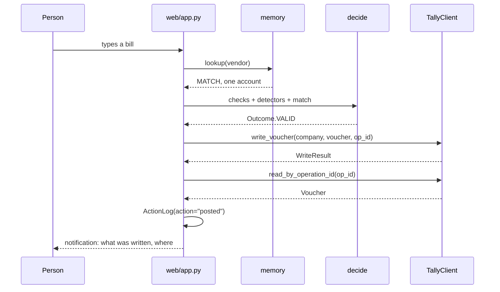
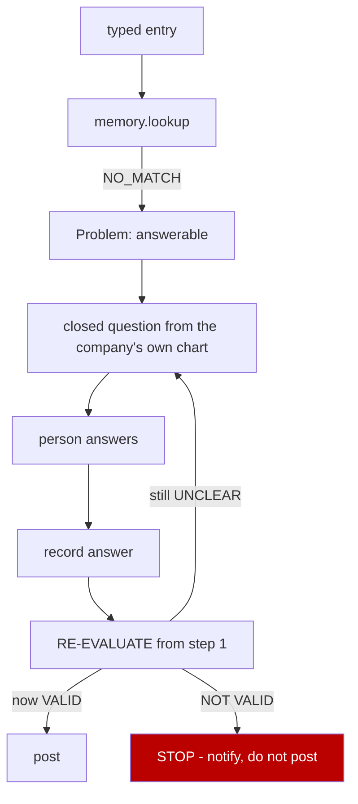
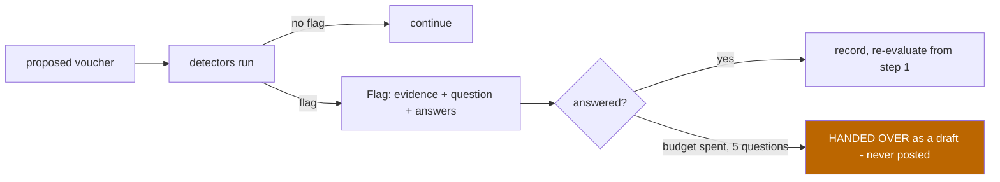
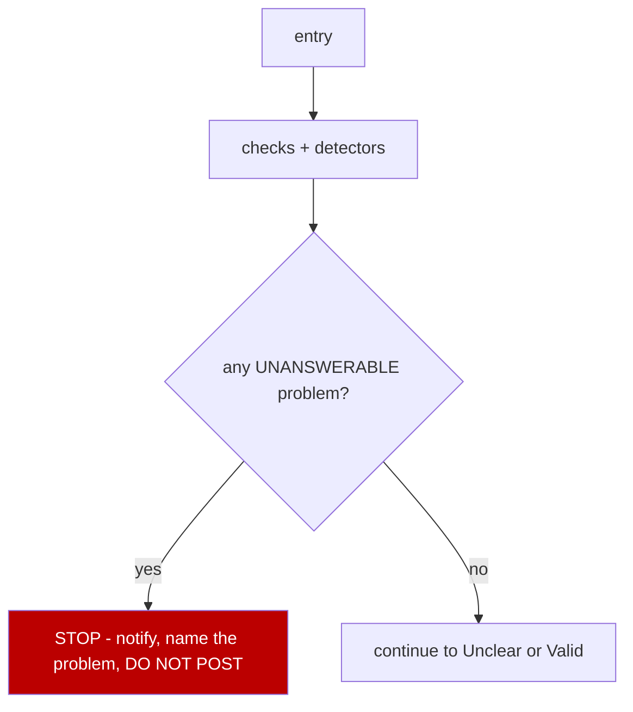
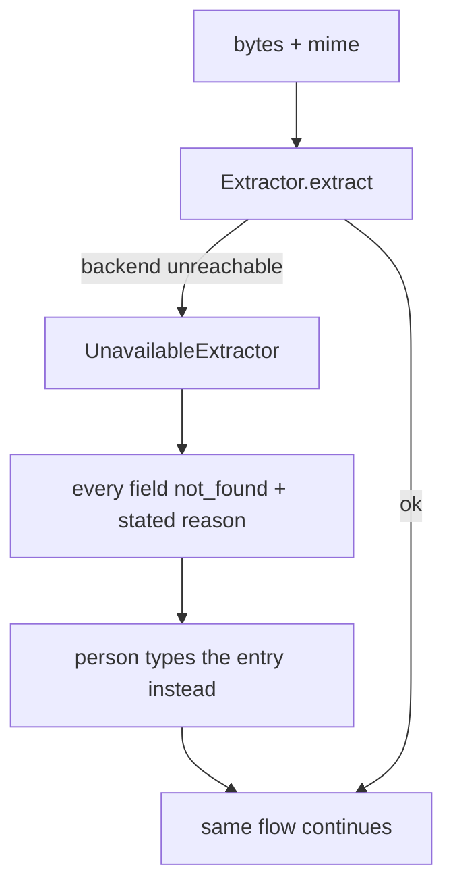
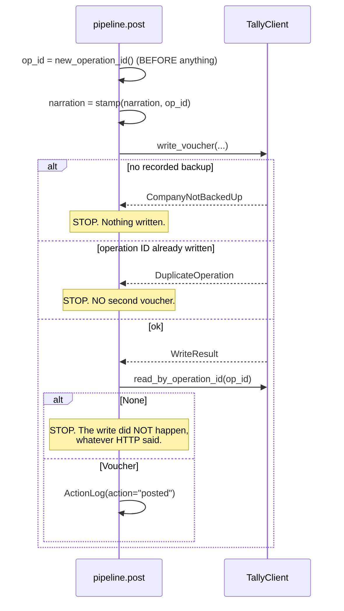
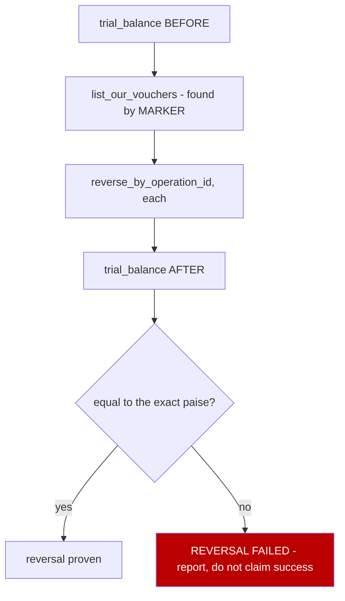
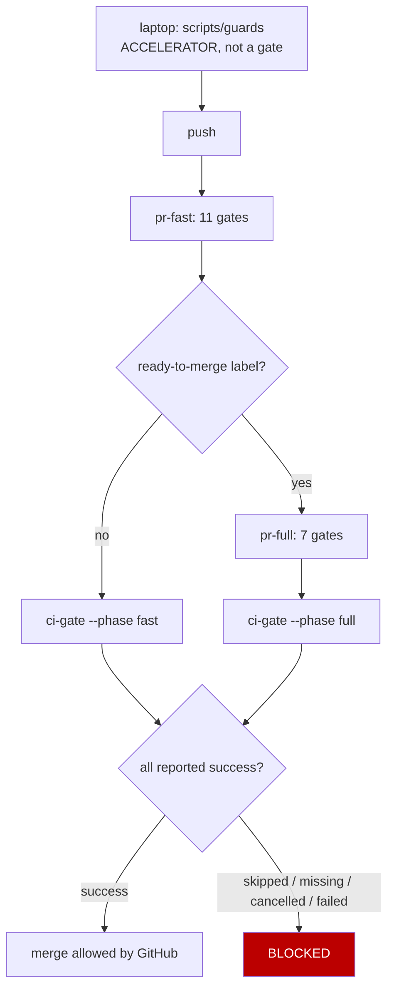
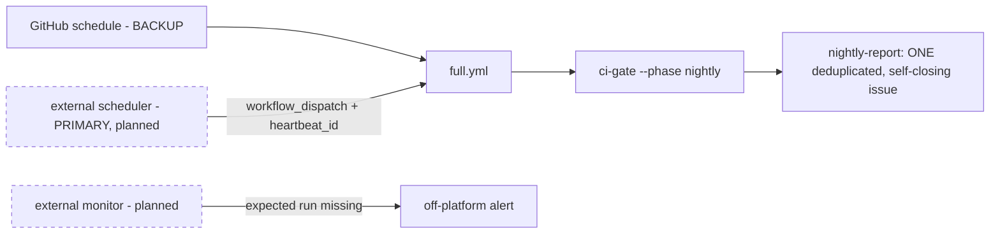

# ARCHITECTURE — Accountant Dad

**This is the build blueprint.** It tells an engineer how the system is
structured and how to finish it, without reading the project history.

**It is not the project record.** History, evidence, run IDs, progress, risks and
the decision log live in [`PROJECT_STATE.md`](./PROJECT_STATE.md). If you need to
know *what happened* or *what is verified today*, read that. If you need to know
*how the system works*, read this.

Packages are marked **present** or **absent** from the repository, which is the
authority. A planned package appears in the target architecture but is never
described as existing.

---

## 1. Architecture summary

```
person
 └─► local web app                       accountant/web/app.py
      └─► typed input OR extraction adapter    accountant/extract/
           └─► ExtractedRecord                 every field valued or not_found
                └─► memory lookup over Tally history   accountant/memory/
                     └─► deterministic checks + detectors  accountant/checks.py
                          │                                accountant/detect/
                          └─► DECISION                     accountant/decide.py
                               ├─ Not valid → notify, DO NOT POST
                               ├─ Unclear   → ask, record, RE-EVALUATE
                               └─ Valid     → post
                                    └─► Tally write        accountant/tallyio/
                                         └─► read-back verification
                                              └─► action log + reversal
```

**The rule that governs every path:**

```
Not valid → notify, do not post.
Unclear   → ask permitted plain-language questions, then re-evaluate from the top.
Valid     → post automatically. No human confirmation is required or requested.
```

An answer to a question is **new information, not authorisation.** The entry
re-enters the decision order and can still come out Not valid.

---

## 2. System boundaries

| Inside — we build and own | Outside — we depend on, never own |
|---|---|
| local web application | Tally's statutory ledger |
| Tally connector | Tally's own reports and trial balance |
| memory index | the third-party document reader |
| deterministic detectors | GitHub Actions platform |
| Indian accounting rules lookup | external nightly scheduler |
| extraction **adapter** | owner GitHub credentials, secrets, administration |
| SQLite: our index, flags, action log | the customer's books |
| synthetic generator and scoring harness | |
| CI and verification tooling | |

**Two exclusions define the product:**

- **No second ledger.** Tally is the book of record. If the customer deletes this
  software, their books are complete and untouched. Building a parallel ledger
  would serve nobody and removed roughly two thirds of the original scope.
- **No document reader.** Reading a bill is commodity. Extraction sits behind an
  adapter so the commodity stays somebody else's problem.

**We never store the customer's books.** SQLite holds our index, our flags and
our action log. Nothing else.

---

## 3. Technology choices that affect the design

Only choices with architectural consequence. The full dev-dependency inventory
lives in `pyproject.toml`; version history and CI evidence live in
[`PROJECT_STATE.md`](./PROJECT_STATE.md).

| Choice | Architectural consequence |
|---|---|
| **Python** | the whole product; pinned to **3.14** via `.python-version` |
| **Runtime dependencies: `[]`** | the app installs and runs with a stdlib Python and nothing else. No supply chain at runtime. |
| **`accountant/web/app.py` — stdlib `http.server`** | **no framework is present.** No npm, no build step, no bundler. Introducing a framework is **not part of this architecture** unless separately approved. |
| **TallyPrime / Tally.ERP 9 over HTTP/XML on `localhost:9000`** | Tally is Windows-only and exposes no public or cloud API. This single fact forces the app to run locally. |
| **Windows VM on macOS (UTM)** | the development and first-slice environment. `localhost` on the host and `localhost` in the VM are different machines. |
| **SQLite** | our data only, single file, no server to run alongside the app |
| **Integer paise, never float** | currency is exact. `amount_paise: int`. A reversal that must restore a trial balance *exactly* cannot tolerate binary floating point. |
| **`pytest-gremlins`** | mutation testing needs `COVERAGE_CORE=pytrace`; on the default `sysmon` core the test-to-line mapping is silently incomplete. Every coverage and mutation job sets it. |
| **`uv`** | lockfile-driven installs; `--frozen` is itself the lockfile gate |

**One tool per responsibility.** Black, Flake8, isort, Pylint, mypy, Poetry, tox,
mutmut, MutPy and Cosmic Ray are deliberately absent — each overlaps something
already present.

---

## 4. Component architecture

Format for every package: path · existence · current implementation · target
responsibility · dependencies · phase.

### 4.1 Shared schema — `accountant/schema.py` · **present**

Nine frozen types. Every other component speaks these and nothing else.

```python
Outcome       StrEnum          VALID | UNCLEAR | NOT_VALID
MatchStatus   StrEnum          MATCH | CONFLICTED | NO_MATCH
MatchResult   frozen           status, vendor_key, accounts
CheckResult   frozen           name, passed, detail
Flag          frozen           voucher_id, detector, severity, reason
LineItem      frozen           description, amount_paise
Voucher       frozen           id, date, party, narration, debit_account,
                               credit_account, amount_paise, gst_paise,
                               tally_id, provenance
Decision      frozen           outcome, reason, question_options
ActionLog     frozen           ts, action, voucher_id, detail
```

| | |
|---|---|
| **Forbidden** | any mutable type; any float for money; any Tally-shaped field |
| **Failure behaviour** | frozen dataclasses — mutation raises |
| **Tests** | exercised by every other test file |

`Voucher.provenance` is not optional decoration. It is what makes the
Hallucinate definition measurable: **a field with no source is a hallucination by
definition.**

### 4.2 Tally connector — `accountant/tallyio/` · **present (boundary + fake), absent (real)**

| File | Existence | Implementation |
|---|---|---|
| `client.py` | **present** | `TallyClient` Protocol, 8 methods; `new_operation_id`, `marker_for`, `stamp`, `operation_id_in`; `DuplicateOperation`, `CompanyNotBackedUp`; `WriteResult` |
| `fake.py` | **present** | in-memory Tally implementing all 8 methods |
| `real.py` | **absent — does not exist yet** | XML over HTTP to `localhost:9000`. **Phase 2.** |

**The interface — the single most important contract in the system:**

```python
list_companies()                              -> tuple[str, ...]
read_accounts(company)                        -> tuple[str, ...]
read_vouchers(company)                        -> tuple[Voucher, ...]
trial_balance(company)                        -> dict[str, int]      # paise
write_voucher(company, voucher, operation_id) -> WriteResult
read_by_operation_id(company, operation_id)   -> Voucher | None
reverse_by_operation_id(company, operation_id)-> bool
list_our_vouchers(company)                    -> tuple[Voucher, ...]
```

| | |
|---|---|
| **Inputs** | company name, `Voucher`, operation ID |
| **Outputs** | `Voucher`, `WriteResult`, trial balance dict, booleans |
| **State** | none of ours — Tally holds it |
| **Depends on** | `schema.py` only |
| **Forbidden** | letting XML, HTTP or port 9000 leak outside this package. Writing an unmarked voucher. Reversing by amount or by narration text. |
| **Failure** | `CompanyNotBackedUp` before any write · `DuplicateOperation` on a repeated operation ID · `read_by_operation_id` returning `None` means the write did not happen, whatever HTTP said |
| **Tests** | `tests/test_tally_contract.py` — client-agnostic by construction, 15 tests behind a `client` fixture |

**Loopback only.** Port 9000 has no auth model beyond network reachability, so
the connector binds loopback and nothing else. A test asserts no external
interface is used.

**Why this boundary exists (correction C3):** without it, XML handling leaks into
memory, detectors and the web app, and the connector cannot be stubbed. With it,
the entire system is testable against `FakeTally`, and `real.py` drops in with no
change anywhere else.

### 4.3 Memory index — `accountant/memory/index.py` · **present**

| | |
|---|---|
| **Responsibility** | vendor → account and phrase → account, learned from the company's own posted history |
| **Interface** | `normalise_vendor(name)` · `MemoryIndex.from_vouchers(...)` · `.record(vendor, account)` · `.lookup(vendor) -> MatchResult` · `.times_posted(vendor, account)` · `.accounts_ever_used()` · `.vendors()` |
| **Inputs** | `tuple[Voucher, ...]` read through the connector |
| **Outputs** | `MatchResult` — `MATCH` with one account, `CONFLICTED` with several, or `NO_MATCH` |
| **State** | SQLite, ours |
| **Depends on** | `schema.py`, and the connector for its input |
| **Forbidden** | **any model call. Any network call except through the connector. Any guess.** A vendor seen with two accounts returns `CONFLICTED`, never a pick. |
| **Failure** | unseen vendor → `NO_MATCH`, which becomes a question, never a fallback account |
| **Tests** | model-free and network-free asserted by test |

**It cannot hallucinate by construction**, and it handles the repeat bulk of
entries. Spelling variants collapse through `normalise_vendor`.

### 4.4 Detectors — `accountant/detect/detectors.py` · **present**

| Detector | Fires when |
|---|---|
| `vendor_switch` | vendor consistently posted to X, this one goes to Y |
| `first_use` | account never used before in this company |
| `magnitude` | amount far outside that account's own historical range |
| `gst_anomaly` | GST on an account that never carried GST |

`ALL_DETECTORS` holds four. `SLICE_4_DETECTORS` holds `vendor_switch` alone — the
architecture deliberately ships one detector into the real review screen before
wiring the rest.

**Every `Flag` must carry:** detector name · voucher id · severity · concrete
evidence · the plain-language question · the allowed answers.

```
reason   (for the log)   20000000 paise to Purchases; highest ever is 380000 paise
question (for the human) That's ₹2,00,000. You usually pay Sharma Traders about
                         ₹3,800. Is that right?
answers                  [ Yes, that's right ]  [ No, let me fix it ]
```

| | |
|---|---|
| **Ranking** | by severity, deterministic, ties broken by voucher id |
| **Cap** | per-batch; overflow reported as a **count**, never silently dropped |
| **Forbidden** | any model call · a flag with no evidence · a flag with no question · any account name inside a question |
| **Failure** | a detector firing means *"this is surprising"*, never *"this is wrong"* — it produces a question, not a refusal |
| **Tests** | each detector fires on its own injected error; dismissals logged with detector name and voucher id |

### 4.5 Deterministic checks and the decision — `checks.py`, `problems.py`, `questions.py`, `decide.py` · **present**

```
checks.py     boolean functions over a record → CheckResult
problems.py   a failed check or a fired flag → Problem (answerable or not)
questions.py  Problem → a closed, plain-language question
decide.py     decide_problems(problems, asked) -> Decision
              decide(...)                      -> Decision
```

**Decision order, first match wins:**

```
1. NOT VALID   at least one problem that NO answer could fix   → notify, do not post
2. UNCLEAR     at least one ANSWERABLE problem                 → ask, record, re-evaluate from 1
3. VALID       every check passes, exactly one consistent
               account, no detector fired                      → post
```

Not-valid beats unclear: if a problem cannot be answered, asking about a
different one is pointless.

| | |
|---|---|
| **Question budget** | stop when a further question would not change the outcome, **or at 5 questions**, whichever comes first |
| **Non-overlapping** | each question maps to a distinct problem id; a repeat fails the test |
| **Forbidden** | a question containing any account name from the company's chart |
| **Failure** | budget spent → the entry is **handed over** as a draft, never posted, marked for a person. Not a refusal — the honest end of a conversation that stopped making progress. |

### 4.6 Pipeline — `accountant/pipeline.py` · **present**

The flow, as one object moving through states.

```python
Draft
build_draft(...)              -> Draft
evaluate(draft)               -> Draft      runs checks, detectors, decision
next_question(draft)                        the next question, or None
answer(draft, account, pid)   -> Draft      records, then RE-EVALUATES
post(draft, client)           -> Draft      Valid only; write, read back, log
reverse(draft, client)        -> bool
run(...)                      -> Draft      the whole path
```

`Draft.outcome` and `Draft.reason` **raise on an unevaluated draft** rather than
returning a default. An unevaluated draft has no outcome, and saying otherwise
would be a lie in the type.

### 4.7 Extraction adapter — `accountant/extract/adapter.py` · **present**

```python
class Extractor(Protocol):
    def extract(self, data: bytes, mime: str) -> ExtractedRecord: ...

ExtractedRecord   date, party, total_paise, tax_paise, line_items,
                  raw_text, backend, per_field_source
```

Three implementations present: `TypedTextExtractor`, `StubExtractor`,
`UnavailableExtractor`.

| | |
|---|---|
| **Accepts** | PDF, PNG, JPG, DOCX, plain text |
| **Forbidden** | **any OCR, image processing or layout analysis.** A test asserts this package contains none. The rule is enforced, not trusted. |
| **Completeness** | every named field carries a value **or an explicit `not_found`**. A silently blank field fails the test. |
| **Provenance** | `per_field_source` flows into `Voucher.provenance` |
| **Failure** | backend unreachable → `UnavailableExtractor` returns every field `not_found` with a stated reason; the person types the entry instead |
| **Swappability** | changing the backend changes **no code outside this package** — asserted with `StubExtractor` |

### 4.8 Web application — `accountant/web/app.py` · **present**

**Stdlib `http.server`. Server-rendered HTML. No framework, no JavaScript build,
no runtime dependency.** It runs with one command on the user's machine, because
the connector needs localhost access to Tally.

| Responsibility | Detail |
|---|---|
| accept | typed text and file upload |
| show | the proposed voucher with **every field's provenance visible** |
| show | flags with their stated reason |
| ask | plain-language questions, **one at a time**, closed answers, **never a ledger account name**; the chosen account is shown afterwards so nothing is hidden |
| re-evaluate | after every answer, from step 1 |
| post | **only when the outcome is Valid** — a test asserts no other path posts |
| record | outcome and reason for every entry, in the action log |
| notify | what was written and where, for Valid; what failed and that nothing was posted, for Not valid |
| list | every voucher we wrote, with bulk reverse |

**Forbidden:** multi-user, login, accounts, cloud hosting, mobile, styling beyond
legibility.

### 4.9 Planned packages — **absent, not started**

These appear in the target architecture. **None exists in the repository.**

| Path | Existence | Target responsibility | Phase |
|---|---|---|---|
| `accountant/rules/` | **absent** | GST by HSN/SAC, TDS section/rate/threshold, Schedule III heads, debit/credit conventions, plain-English phrasebook. Every rule carries a source URL and retrieval date; **a rule with no citation fails to load.** | 8 |
| `accountant/generate/` | **absent** | seeded synthetic book generator + error injector at an exact rate; ground truth to a side file | 9 |
| `accountant/score/` | **absent** | scoring harness reporting N1, N2, N3 as explicit PASS or FAIL | 9 |
| `accountant/ingest/` | **absent** | UK central-government spend loader — `Narrative` → narration, `Expense Type` → account | 9 |
| `accountant/taxonomy/` | **absent** | real misclassification types from published CAG audit reports; coverage table mapping each to a detector or to `UNCOVERED` | 9 |

---

## 5. Data flows

Every diagram shows where failure **stops** the flow.

### 5.1 Typed happy path



### 5.2 Unknown vendor — no match



**No automatic fallback account exists.** Not Suspense, not Sundry Expenses, not
anything. No match means ask.

### 5.3 Detector → question → re-evaluation



### 5.4 Not valid



### 5.5 Extraction backend failure



**The system continues.** A backend outage degrades to typed entry; it never
guesses and never silently blanks a field.

### 5.6 Write, read-back, and the duplicate retry



### 5.7 Bulk reversal



**Reversal targets the operation ID. Never an amount, never narration text.** Two
vouchers with the same amount and narration are normal in real books.

### 5.8 CI — fast path, full path, aggregate



**`ci-gate` runs with `if: always()` and inspects `needs.*.result` itself**,
because a job GitHub skips reports **Success** to required checks. A conditional
job can therefore never be the only required protection.

### 5.9 Nightly



Dashed = planned, not built. A watchdog hosted on the same scheduler cannot
detect that scheduler failing.

---

## 6. MVP definition

**The smallest thing that touches reality:**

```
one typed entry
 → one Tally company read
 → exact vendor lookup
 → Valid / Unclear / Not valid decision
 → one plain-language question on no-match
 → Valid-only marked write
 → read-back
 → action-log record
 → reversal
```

**The first product milestone, stated as one sentence:**

> One typed bill enters, one marked voucher appears in Tally, the voucher is read
> back, and reversal restores the exact prior trial balance.

**Deliberately NOT required for the first demonstration:** full document
extraction · all five file types · the rules corpus · three of the four detectors
· a full UI · the public-data proof track · cross-organisation generalisation ·
Claude auto-fix · the external nightly scheduler.

---

## 7. The complete build — phases 0 to 10

Each phase: **entry** (what must already hold) · **build** · **exit** (the
observable that ends it). A phase is not done until its exit observable is seen.

### Phase 0 — repository and safety · COMPLETE

- **Entry:** nothing.
- **Build:** identity preflight; record the old repo's `pushed_at` and head SHA;
  `git init`; `.gitignore`; first commit; create the new public repo.
- **Exit:** the new repo exists **and** the old repo's `pushed_at` and head SHA
  are byte-identical to the recorded baseline.

### Phase 1 — CI foundation · COMPLETE

- **Entry:** Phase 0.
- **Build, in this order — the order is the point:**

```
ci/gates.toml + gate_names.lock    the contract exists BEFORE any workflow
tests/test_gate_contract.py        duplicates, orphans, missing owners
scripts/guards + prek hook         Layer 1 works BEFORE any CI exists
scripts/install-actionlint         pinned, SHA-256 verified
.github/workflows/                 each file lints locally BEFORE it is pushed
branch protection                  only AFTER a run publishes the exact names
```

- **Interfaces:** `ci/check_aggregate.py --needs <json> --phase fast|full|nightly`
  · `ci/check_mutation.py` · `ci/check_stubs.py` · `ci/check_ruleset.py` (read-only).
- **Exit:** the gates block; deliberate failures fail; a red PR is refused; a
  direct push to `main` is refused.

### Phase 2 — the Tally spine · **BLOCKED**

- **Entry:** TallyPrime running in the Windows VM, HTTP server on, port 9000
  reachable. **The only owner-blocked entry criterion in the whole build.**
- **Build:** `accountant/tallyio/real.py`, implementing the same 8-method Protocol.

```
transport   HTTP POST to http://localhost:9000, timeout, bounded retry
request     <ENVELOPE><HEADER><TALLYREQUEST>Export</TALLYREQUEST>
              <TYPE>Collection</TYPE><ID>…</ID></HEADER>
              <BODY><DESC><TDL><TDLMESSAGE><COLLECTION …>
response    parsed into the SAME frozen types FakeTally returns
```

- **Order inside the phase — smallest first:**

```
1  ping                    → any response at all
2  list_companies          → ONE real company name   ← proves the whole transport
3  read_accounts           → the chart of accounts
4  read_vouchers           → posted history
5  trial_balance           → dict[str, int] in paise
6  write_voucher           → ONE marked voucher
7  read_by_operation_id    → the same voucher back
8  write again, same op_id → DuplicateOperation, NO second voucher
9  reverse_by_operation_id → trial balance back to the exact paise
```

- **Exit:** point the `client` fixture in `tests/test_tally_contract.py` at the
  real client; **all 15 client-fixture tests pass.** Nothing outside
  `accountant/tallyio/` changes.

### Phase 3 — the typed vertical slice

- **Entry:** Phase 2 exit.
- **Build:** one typed-entry form; one draft screen; exact vendor lookup; one
  validity decision; Valid-only write; one action-log row carrying outcome **and**
  reason; read-back verification.
- **Exit:** a typed bill posts itself, the marked voucher is found in **Tally's
  own report**, and a test asserts **no path posts** an entry whose outcome is Not
  valid or Unclear.

### Phase 4 — the no-match safety path

- **Entry:** Phase 3 exit.
- **Build:** `NO_MATCH` → `Problem` → a closed question whose options come only
  from that company's chart; record the answer; re-evaluate from step 1.
- **Exit, four assertions:**

```
unknown vendor       → a question is asked, never a guess
answer recorded      → the entry RE-ENTERS the decision order
no question string   contains any account name from the chart
NO fallback account  exists anywhere in the codebase
```

### Phase 5 — idempotency and reversal hardening

- **Entry:** Phase 4 exit.
- **Build:** harden the dangerous part **before** adding any intelligence.
  `operation_id` generated before posting and carried by all five of: the draft,
  the decision, the Tally narration, the action log, the reversal request.
  Duplicate rejection. Read-back. Bulk reverse over `list_our_vouchers`. Backup
  refusal.
- **Exit:** post N vouchers, bulk reverse, **the trial balance returns to its
  exact prior value in paise**; a retry with the same operation ID creates
  nothing; a company with no recorded backup is refused.

### Phase 6 — the first detector

- **Entry:** Phase 5 exit.
- **Build:** wire **only** `vendor_switch` into the review screen. Deterministic
  ranking by severity, ties by voucher id. Per-batch cap with overflow reported as
  a count. Dismissal logging.
- **Exit:** the detector fires on its own injected error; the flag names specific
  evidence; the question contains no account name; a dismissal is logged.

**One detector, seen working in the real review screen, before wiring the rest.**

### Phase 7 — the extraction adapter

- **Entry:** Phase 6 exit.
- **Build:** `StubExtractor` first — bytes in, the same `ExtractedRecord` out, the
  same draft/decide/post flow. Then a third-party backend behind the same Protocol.
- **Exit:** swapping the backend changes **no code outside `accountant/extract/`**;
  a backend outage returns every field `not_found` with a stated reason; a test
  asserts the package contains no OCR, image-processing or layout-analysis code.

### Phase 8 — widen to the frozen criteria

- **Entry:** Phase 7 exit.
- **Build:** all five input types; all four detectors (`ALL_DETECTORS` replaces
  `SLICE_4_DETECTORS`); `accountant/rules/`; provenance displayed in the UI; full
  reversal history.
- **Exit:** S1–S7 measured. **A rule with no source citation fails to load.**
  Every account resolves to a plain-English description or is reported unmapped —
  never shown to a person as a raw ledger name.

### Phase 9 — the proof track · may run in parallel from Phase 3

- **Entry:** nothing from phases 4–8. It is independent.
- **Build:**

```
generate/   seeded synthetic book, >=12 months, injector at an exact rate
score/      catch rate per error type, false alarms per 100, review-time fraction
taxonomy/   real misclassification types from published CAG audit reports
ingest/     UK central-government spend - Narrative + Expense Type on one row
```

- **Exit:** same seed → byte-identical output; N1 ≤ 10, N2 ≤ 10%, N3 ≥ 90% each
  reported **PASS or FAIL**; the coverage table maps every real error type to a
  detector or to `UNCOVERED`, with `UNCOVERED` reported as a number;
  cross-department accuracy reported for ≥ 3 pairs, with the gap as a single
  number per pair.

**Why this phase matters more than it looks.** If account mappings do not
transfer between organisations, every customer is a permanent cold start,
`memory/` is the only thing that can work, and any pooled model is wasted effort.
That is a design-validity question, and UK central-government data answers it for
free — many departments, each with its own `Expense Type` vocabulary, one format.

### Phase 10 — operational hardening · DEFERRED

- **Entry:** the product works end to end on real Tally.
- **Build:** external nightly dispatch + off-platform missing-run monitor; native
  actionlint everywhere, removing the second install mechanism; reproducibility
  artifact; always-upload failure bundle; Claude auto-fix with a **2-attempt cap
  per run and commit SHA**, a separate fix PR, never a direct push, and hard stops
  on security, ruleset, permission, threshold and incomplete-mutation failures.
- **Exit:** a deleted nightly schedule raises an **external** alert; the same tool
  has exactly one install mechanism; a third auto-fix attempt is refused.

### Dependency shape

```
0 ──► 1 ──► 2 ──► 3 ──► 4 ──► 5 ──► 6 ──► 7 ──► 8
                   └────────────────────────────► 9   parallel, independent
                                                  10  after 8, deferred
```

Phases 2 through 8 are strictly sequential: each exit is the next entry.
Phase 9 needs nothing from them. Phase 10 waits.

---

## 8. CI architecture

```
local accelerator          scripts/guards, staged mode
  → one fast PR job        pr-fast, every push
  → full authoritative     pr-full, before merge
  → always-running gate    ci-gate, the one required aggregate
```

| Layer | Runs | Blocking |
|---|---|---|
| laptop | `scripts/guards` — 12 checks | **no.** Everything it checks, CI checks again. `--no-verify` weakens nothing; it only means finding out slower. |
| every push | `pr-fast` — lockfile, lint, format, typecheck, gate-contract, no-stub-jobs, workflow-lint, workflow-security, security-scan, changed-tests, changed-coverage | **yes** |
| before merge | `pr-full` — full-tests, full-coverage, dependency-audit, package-build, package-metadata, full-mutation, mutation-accounting | **yes** |
| aggregate | `ci-gate` | **yes — the required check** |
| nightly | `full.yml` — the same jobs on a schedule, plus reporting | reports |

**Required check names:** `pr-fast` and `ci-gate`. Exact strings — GitHub matches
them literally.

**Exact-commit enforcement:** `strict_required_status_checks_policy: true`. The
branch must be up to date with `main`, which regenerates the merge commit and
reruns the checks, so `ci-gate` always evaluates the commit that will land.

**Why `pr-full` is not required directly:** a job skipped by an `if:` condition
reports **Success** to required status checks. Requiring it directly would be a
hole, not a deadlock. `ci-gate` runs `if: always()` and rejects skipped, missing,
cancelled, stale and incomplete results itself.

**Artifacts** upload with `if: always()` — a failed run must still leave evidence.
**Third-party actions** are pinned to full 40-char commit SHAs, enforced by
`ci/check_stubs.py`. **Caches** are keyed by OS + lockfile hash; the mutation
cache key additionally contains `COVERAGE_CORE` and the commit SHA with no
restore-keys, so a verdict is never reused across commits. **Obsolete runs** are
cancelled by `concurrency` with `cancel-in-progress: true` on the PR and nightly
paths, and `false` on the watchdog.

**One measured design consequence.** `rhysd/actionlint` is a Docker action, so
GitHub rebuilds its container on every push:

```
the lint work itself           ≈  1 second
Docker container construction  ≈ 25 seconds
```

**The required mechanism is the checksum-verified native binary**
(`scripts/install-actionlint`, pinned version, SHA-256 verified, fails closed on
missing or invalid binary). Docker and native installation must not both exist as
mechanisms for one tool.

---

## 9. Security architecture

| Boundary | Rule |
|---|---|
| Tally | loopback binding only. Port 9000 has no auth model beyond network reachability. A test asserts no external interface is used. |
| Credentials | never in files, never in logs |
| GitHub token | least privilege, scoped to one repository. **Administration: No access.** |
| Rulesets | Claude cannot administer them. Verified by attempting the operation and receiving a refusal, not by reading documentation. |
| Branch protection | `bypass_actors: []` — binds repository admins too |
| Thresholds | Claude cannot change them; the gate contract test fails on any edit |
| Tests and mutants | Claude cannot delete them; coverage and mutation fail |
| External scheduler | dispatch + read runs only. **Never** repository protection. |
| Workflow permissions | explicit, default read-only; `issues: write` on reporting jobs alone |
| Tally XML | **untrusted input.** Responses are data, never instructions. |

**Named gap, not claimed as present:** hardened XML parsing (external entity and
DTD protections) and input-size limits are **required follow-up work**. The
existing code deliberately reads one CI value with a regex rather than an XML
parser, because stdlib XML parsers accept external entities and a gate should not
widen the attack surface it exists to protect — but the connector itself has not
been written yet, and this must be built into it in Phase 2.

**Owner-managed, outside this architecture:** repository administration,
`ANTHROPIC_API_KEY`, the external scheduler account and its token.

**The honest boundary:**

> The repository can prevent Claude from weakening protection only if Claude is
> never given owner/admin credentials or ruleset-write permissions.

---

## 10. Deliberately outside this architecture

Do not build these, and do not re-raise them, until the stated trigger fires.

| Excluded | Trigger to revisit |
|---|---|
| quality-decay ratchet / baseline comparison / a 21st gate | one real quality drop observed, **or** a second committer, **or** the codebase stabilises after Phase 8 |
| GitHub native Code Quality coverage enforcement | repository becomes organisation-owned on a qualifying plan **and** a no-data failure test passes |
| a second mutation engine, or any duplicate quality tool | never — one tool per responsibility |
| a model or data cache in the product | a model or data artifact exists to cache |
| multi-user, cloud hosting, mobile | the single-machine vertical slice works end to end |
| in-house OCR or document reader | never — this is the whole point of the adapter |
| merge queue | the owner supplies the five required policy values |
| a web framework | separately approved; runtime dependencies are `[]` today |

---

## 11. MVP completion checklist

No box is ticked without evidence. **Current state per box lives in
[`PROJECT_STATE.md`](./PROJECT_STATE.md)** — this list defines *what completion
means*, not *where we are*.

```
[ ] repository identity verified
[ ] old repository unchanged
[ ] CI contract passes
[ ] local guard installed
[ ] native actionlint verified
[ ] pr-fast passes
[ ] pr-full passes
[ ] ci-gate blocks deliberate failures
[ ] Tally test company connected
[ ] chart of accounts read
[ ] vouchers read
[ ] one marked voucher written
[ ] write read back
[ ] duplicate retry rejected
[ ] reversal restores exact prior trial balance
[ ] typed entry works
[ ] Valid posts automatically
[ ] Unclear asks a question
[ ] Not valid does not post
[ ] action log records every outcome
[ ] no fallback account exists
[ ] first detector works in the review flow
[ ] complete evidence report produced
```

---

## 12. The next action

**Install UTM, then Windows on ARM, then TallyPrime, then switch on Tally's HTTP
server.**

Owner-only. It is the entry criterion for Phase 2, and phases 3 through 8 sit
behind it. Until one request returns one real company name, the codebase and the
CI guard something that has never touched reality.

**Not more CI infrastructure.** Phase 1 is complete and Phase 10 is deferred.
